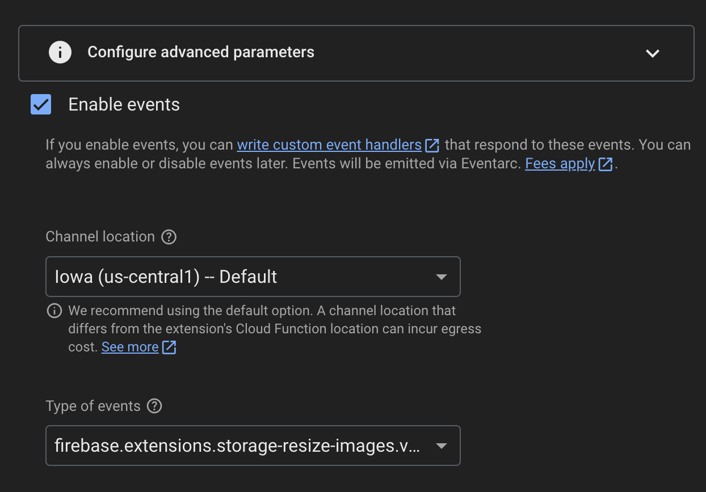
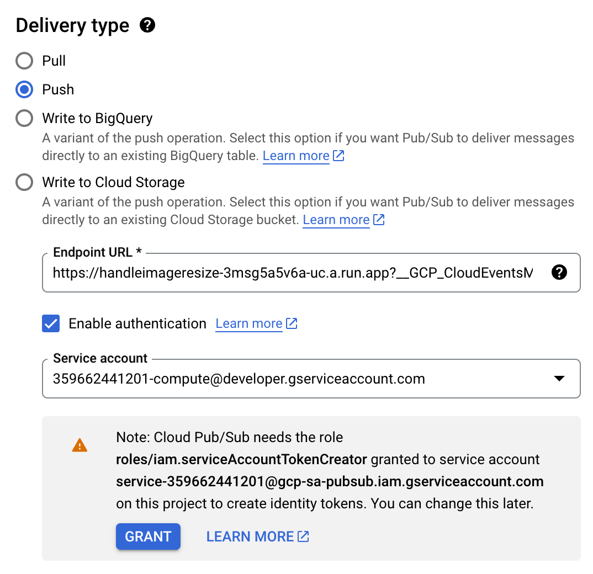

# Contents

The Firebase documentation leaves much to be desired. If you just want answers, these docs were made just for you. If you want more questions, head over [here](https://extensions.dev/extensions/firebase/storage-resize-images) and start reading.

In this blog, I'm going to walk you through setting up the [Resize Images Firebase Extension](https://extensions.dev/extensions/firebase/storage-resize-images) and listening to a custom event so you can add the resized images to documents in your Firestore database.

## Setting Up the Extension

Navigate to your Firebase project and select the Extensions item from the "Build" side menu. Select the "Explore all Extensions" button and then search for "resize images". Press the "Install" button. Good job, buddy.

Use the following basic settings:
- Sizes of resized images: 200x200
- Deletion of original file: Don't delete
- Make resized images public: Yes

In the "Paths that contain images you want to resize" field, you only need to add the parent path and all child paths will be included as well. For example, `/recipes` includes `/recipes/{id}/users/{user_id}`.

To send events when your resize task is finished, check the box to enable events at the bottom of the config screen:



## Locating the Proper Permission

The Firebase setup docs mention that permissions might be an issue but they don't mention which ones exactly:

> If events are enabled, and you want to create custom event handlers to respond to the events published by the extension, you must ensure that you have the appropriate role/permissions to subscribe to Pub/Sub events.

Luckily someone [listed them out on GitHub](https://github.com/firebase/extensions/pull/967#issuecomment-1186171281).

"Here are the steps:

- in the Eventarc UI in Cloud console go to the "Triggers" page and select the trigger for your function.
- in the "details" there's a "Topic" with a link to the pubsub topic used for this trigger, click on the topic link
- under "subscriptions" click on the subscription (ID) to navigate to the subscription details
- click on "EDIT" at the top to edit the subscription
- under "Delivery type" check that:
    - "Push" type is selected
    - "Enable authentication" is checked
    - PROJECT_NUMBER-compute@developer.gserviceaccount.com service account is selected.

see if there's a warning message under the "service account" field (it usually says something like "Note: Cloud Pub/Sub needs the role roles/iam.serviceAccountTokenCreator granted to service account..."). If you see that warning press "GRANT" button."



## Create Your Function

When the resize image extension finishes executing, it will trigger the following event:

```
firebase.extensions.storage-resize-images.v1.onSuccess
```

To listen for this and take action based on its contents, initialize Firebase functions in your project and then create a new function called `handleImageResize`:

```typescript
export const handleImageResize = onCustomEventPublished(
  "firebase.extensions.storage-resize-images.v1.onSuccess",
  async (event) => {
    console.log("Received event:", event);
    const resizeEvent = event as ResizeEvent;
    const filePath = event.data.input.name;

    // Extract the recipe ID from the file path
    // Assuming the file path is in the format:
    // "recipes/{recipeId}/images/{imageName}"
    const pathParts = filePath.split("/");
    if (pathParts.length < 4 || pathParts[0] !== "recipes") {
      console.log("Invalid file path structure:", filePath);
      return;
    }

    const recipeId = pathParts[1];
    // const imageName = pathParts[pathParts.length - 1];

    try {
      const recipeRef = db.collection("recipes").doc(recipeId);
      const recipeDoc = await recipeRef.get();

      if (!recipeDoc.exists) {
        console.log("Recipe not found:", recipeId);
        return;
      }

      // Update the recipe document with the new thumbnailImage field
      await recipeRef.update({
        thumbnailImage: resizeEvent.data.outputs[0].outputFilePath,
      });

      console.log(
        "Updated recipe:",
        recipeId,
        "with new thumbnailImage:",
        filePath
      );
    } catch (error) {
      console.error("Error updating recipe:", error);
    }
  }
);
```

I also created a `ResizeEvent` interface to help utilize the event data that's provided when the custom event is triggered:

```typescript
interface ResizeEvent {
  subject: string;
  specversion: string;
  id: string;
  time: string;
  type: string;
  source: string;
  data: {
    input: {
      bucket: string;
      contentDisposition: string;
      contentType: string;
      crc32c: string;
      etag: string;
      generation: string;
      id: string;
      kind: string;
      md5Hash: string;
      mediaLink: string;
      metadata: Record<string, string>;
      metageneration: string;
      name: string;
      selfLink: string;
      size: string;
      storageClass: string;
      timeCreated: string;
      timeStorageClassUpdated: string;
      updated: string;
    };
    outputs: {
      size: string;
      outputFilePath: string;
      success: boolean;
    }[];
  };
}
```

An example of what this object looks like is below:

```
{
  subject: 'recipes/vO8bojY3vVFTOj2FlCuO/images/1736088008636195.png',
  specversion: '1.0',
  id: '4e27f826-70ed-4062-9533-185011a67fb3',
  time: '2025-01-05T14:40:13.165Z',
  type: 'firebase.extensions.storage-resize-images.v1.onSuccess',
  source: '//firebaseextensions.googleapis.com/extensions/projects/abi-s-recipes/instances/storage-resize-images',
  data: {
    input: {
      bucket: 'abi-s-recipes.appspot.com',
      contentDisposition: "inline; filename*=utf-8''1736088008636195.png",
      contentType: 'image/png',
      crc32c: 'yOPqOg==',
      etag: 'CMCX7+nn3ooDEAE=',
      generation: '1736088011656128',
      id: 'abi-s-recipes.appspot.com/recipes/vO8bojY3vVFTOj2FlCuO/images/1736088008636195.png/1736088011656128',
      kind: 'storage#object',
      md5Hash: 'dFRuNYsImk92Sv8R+pF/aA==',
      mediaLink: 'https://storage.googleapis.com/download/storage/v1/b/abi-s-recipes.appspot.com/o/recipes%2FvO8bojY3vVFTOj2FlCuO%2Fimages%2F1736088008636195.png?generation=1736088011656128&alt=media',
      metadata: [Object],
      metageneration: '1',
      name: 'recipes/vO8bojY3vVFTOj2FlCuO/images/1736088008636195.png',
      selfLink: 'https://www.googleapis.com/storage/v1/b/abi-s-recipes.appspot.com/o/recipes%2FvO8bojY3vVFTOj2FlCuO%2Fimages%2F1736088008636195.png',
      size: '1710206',
      storageClass: 'STANDARD',
      timeCreated: '2025-01-05T14:40:11.701Z',
      timeStorageClassUpdated: '2025-01-05T14:40:11.701Z',
      updated: '2025-01-05T14:40:11.701Z'
    },
    outputs: [
      {
        "size":"200x200",
        "outputFilePath":"recipes/6mtVesNeUu9p7HkslzGQ
        /images/1736091587510253_200x200.png",
        "success":true
      }
    ]
  },
  traceparent: '00-3efe16f48751291a33df720a821e24d4-f9ef65f49f5406b0-01'
} 
```
## Deploy Your Function

The final step is to deploy the function and then start saving images to Firebase Storage. The following command will deploy this function specifically:

```bash
firebase deploy --only functions:handleImageResize
```