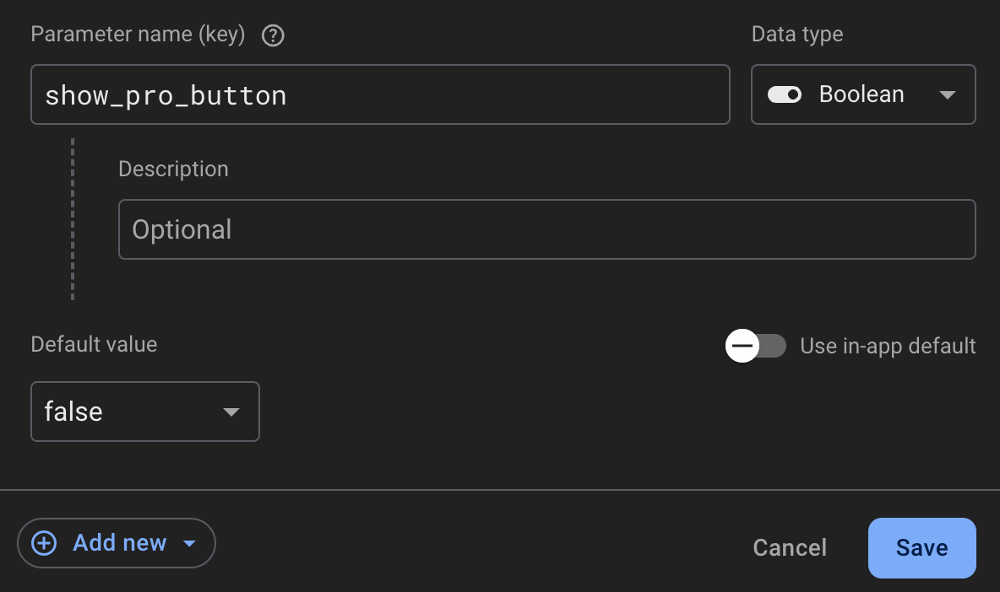
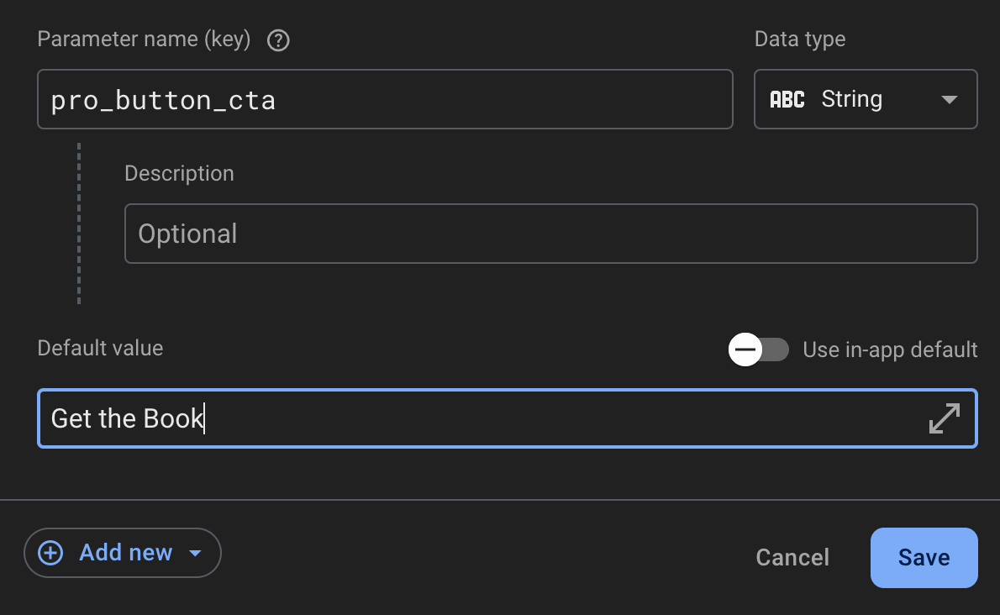

# Contents

I use Firebase [Remote Config](https://firebase.google.com/docs/remote-config/) to manage AB tests in most of my software projects. 

## Boolean AB Testing

Whenever I want to run a new AB test, I create a new boolean parameter in my Remote Config (RC) console with the name of the new test (ex. `show_pro_button`). The default should be `false` since the test will be off for anyone not in the test set.



To create the test set:

1. Select `Add new`
2. Select `Conditional value`
3. Select `Create new condition`
4. Name the new condition (I usually mirror the parameter name so for this example the name would be "Show Pro Button")
5. In the "Applies if..." dropdown, select `User in random percentage` and slide the right slider handle to select the percentage you want to test with (ex. 50)
6. Click `Create condition`

Now, inside of your app, you can read this value, update the app's behavior, and most importantly, save this value in any analytics events so you can track the test results.

## Monitoring the Version

For boolean AB tests, version tracking is not usually necessary. The test is either on or off and the value you record in your analytics platform reflects that (ex. `show_pro_button`: true).

For other data types, like Strings, the value could change multiple times and it would be difficult (although not impossible) to track when changes were made.



Luckily, there is a [different way](https://firebase.google.com/docs/remote-config/parameters?template_type=client) to track changes than performing string comparisons.

> Each time you update your configuration in the Firebase console, Firebase creates and publishes a new version of your Remote Config template

As the docs mention, every time you publish a new Remote Config template, Firebase automatically tracks the new version in an object that looks like this:

```json
{
  "etag": "etag-990554818394-12",
  "parameters": {
    "pro_button_cta": {
      "defaultValue": { "value": "Get the Book" },
      "conditionalValues": { "Show Pro Button": { "value": "true" } }
    },
  },
  "conditions": [
    {
      "name": "Show Pro Button",
      "condition": {
        "orCondition": {
          "conditions": [
            {
              "andCondition": {
                "conditions": [
                  {
                    "percent": {
                      "percentOperator": "BETWEEN",
                      "seed": "acziicobl6xw",
                      "microPercentRange": {
                        "microPercentUpperBound": 50000000
                      }
                    }
                  }
                ]
              }
            }
          ]
        }
      }
    },
    {
      "name": "My Custom Signal",
      "condition": {
        "orCondition": {
          "conditions": [
            {
              "andCondition": {
                "conditions": [
                  {
                    "customSignal": {
                      "customSignalOperator": "STRING_EXACTLY_MATCHES",
                      "customSignalKey": "appId",
                      "targetCustomSignalValues": ["12345"]
                    }
                  }
                ]
              }
            }
          ]
        }
      }
    }
  ],
  "version": { "versionNumber": "12", "isLegacy": true }
}
```

You can retrieve this by calling the `toJSON` method on the Remote Config template:

```typescript
const template = remoteConfig.initServerTemplate({
  defaultConfig: {
    show_pro_button: false,
    pro_button_cta: alternativeGreeting,
  },
});

await template.load();
const config = template.evaluate({
  randomizationId: randomUUID(),
  appId: '12345',
});

const version = Number(
  (template.toJSON() as { version: { versionNumber: string } })?.version
    .versionNumber
);

console.log("Version: " + version);
```

Once you have the RC template version, you can then log that to your analytics platform along with the raw value of the RC parameters. This will make analyzing your tests a lot easier on the eyes ☕️

> [!INFO]
> You can read more about [managing Remote Config templates and versions here](https://firebase.google.com/docs/remote-config/templates?template_type=client)