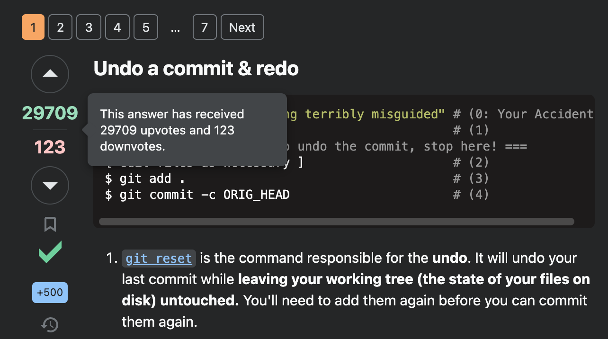

# Contents

## Links

- https://mynoise.net/: Ad-free background noise generator
- https://lobste.rs/: Lobsters is a computing-focused community centered around link aggregation and discussion
- https://netnewswire.com/: Free RSS feed reader
- https://github.com/KKKZOZ/hugo-admonitions: GitHub style callouts for Hugo blogs

## Tips

### Use TYPAC to Install Types

Every time I get linted on missing types, I curse the creators of TypeScript, npm, and anyone related to those projects just to cover may bases. It seems like a flaw in the package management system. If I'm working on a TypeScript project, I _always_ want the types.

[TYPAC](https://github.com/ewgenius/typac) is a little project I came across that attempts to remedy this problem by installing the types for an npm packages if the `@types` exist.

Just install it:

```bash
npm install -g typac
```

And then run it:

```bash
typac <package>
```

Or don't install it and run it:

```bash
npx typac ini -i
```

When I first added this tip, I thought typac looped through all your dependencies to find `@types` but alas, it does not.

### Preview Images in VS Code

I accidentally discovered that if you hover over the image link in VS Code you can preview the image. Ctrl + clicking takes you to the image:


### Git Tricks

#### Undo the Latest Commit in Git

[A simple one](https://stackoverflow.com/a/927386/12806961):

```bash
git reset HEAD~
```



#### View Git Status

```bash
git status
```

## Websocket Basics

All websockets begin as normal HTTP servers. On the `upgrade` event, the server can upgrade to a websocket, allowing bidirectional communication. This [video](https://www.youtube.com/watch?v=2Nt-ZrNP22A) gives a pretty good overview of the process.