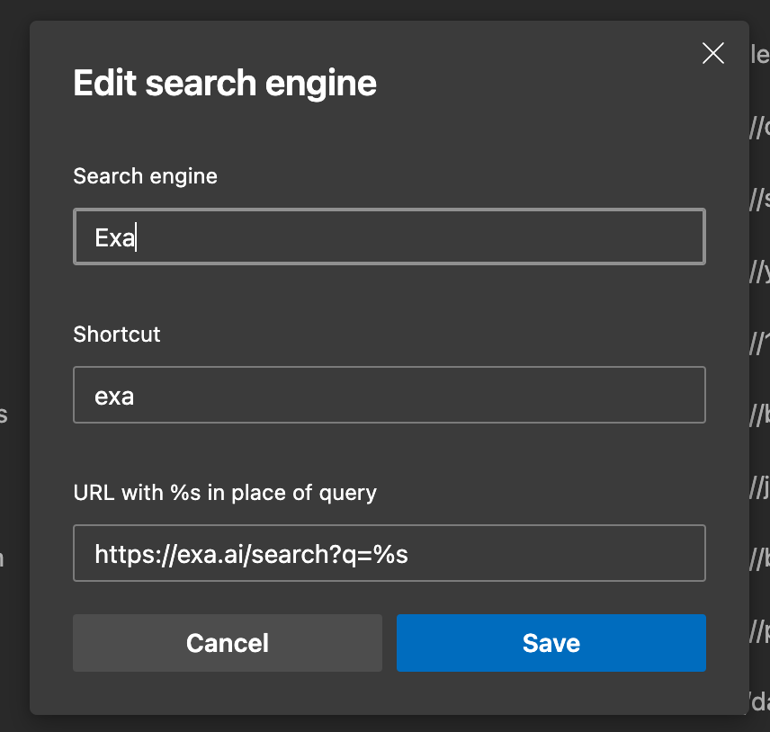

# Contents

## Links
- https://docs.astral.sh/uv/: Extremely fast Python package and project manager
- https://github.com/animotionjs/animotion: Presentational framework for creating slides and visualizing ideas with code
- https://github.com/slidevjs/slidev: Presentation Slides for Developers (with support for [Shiki Magic Move](https://github.com/shikijs/shiki-magic-move))
- https://block.github.io/goose/: On device AI-agent

## Quotes

> God exists since mathematics is consistent, and the Devil exists since we cannot prove it.

André Weil

## Tips

### Open VS Code in Same Window from Command Line

In the past, I would always open new projects in VS code by navigating to them and running the simple and famous command:

```bash
code .
```

This command opens a new window with your project, leaving everything else untouched except for your system's memory usage. This week, I finally decided to see what else was possible and it turns out you can replace the current window with the new one by appending the `-r` flag to the command:

```bash
code . -r
```

It stands for "reuse window" but for me its easier to remember it as "replace".

## Exa AI Search in Edge

As I've discussed in the past, Microsoft Edge is a superior browser and in supporting that title, it allows you to add multiple search engines to your address bar. This week, I added [Exa.ai](https://exa.ai/search) as an option with the prefix `exa`.

> [!NOTE]
> In the past, I'd prefix my prefixes with @ (ex. @ai, @exa, @x) but its faster to omit that and use the prefix directly.

