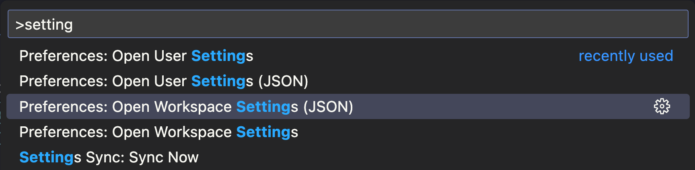

I write a lot of tech focused content for my personal Hugo blog and my side project's Astro website. Both of these documentation frameworks require you to add Frontmatter to the top of each article that outlines specific metadata. For example, the article's title, description, and draft status would go here:

```plaintext
---
title: "Workspace Specific Markdown Snippets"
date: 2025-01-13T17:57:48-05:00
draft: true
---
```

My issue is that I never remember everything that's required by my blog schemas. Tags, categories, publish dates, update dates, etc. 

Luckily, you can [add workspace specific VS Code snippets](https://code.visualstudio.com/updates/v1_28#_project-level-snippets) by simply adding a `.code-snippets` file to the `.vscode` folder at the root of any project.

In the `.vscode` folder of this blog, I created a `blog.code-snippets` file that looks like this:

```json
{
  "Hugo Frontmatter": {
    "prefix": "blogFrontmatter",
    "body": [
      "---",
      "title: ${1:title}",
      "date: $CURRENT_YEAR-$CURRENT_MONTH-${CURRENT_DATE}T$CURRENT_HOUR:$CURRENT_MINUTE:$CURRENT_SECOND$CURRENT_TIMEZONE_OFFSET",
      "draft: ${3:true}",
      "tags: [${4:tag1}, ${5:tag2}]",
      "categories: [${6|tutorials,essays,projects,microblog,cheat-sheets|}]",
      "---"
    ],
    "description": "Hugo Frontmatter"
  }
}
```

:::note
Pressing ctrl + space will still pull up snippets in a markdown file. If that's good enough for you, ignore the next section.
:::

Normally, this would work fine and typing "blogFrontmatter" would show the snippet dropdown. Markdown is different (and I'm assuming it's because Markdown can contain a bunch of words that could trigger false positive snippet activations).

To fix this, you need to open the workspace `settings.json` file... 



...and add the following section ([source](https://stackoverflow.com/questions/68922273/vscodes-user-snippets-not-working-for-markdown-and-latex-files)):

```json
 "[markdown]": {
    "editor.quickSuggestions": {
      "other": true,
      "comments": true,
      "strings": true
    }
  }
```
With that, everything should work as expected. ☕️