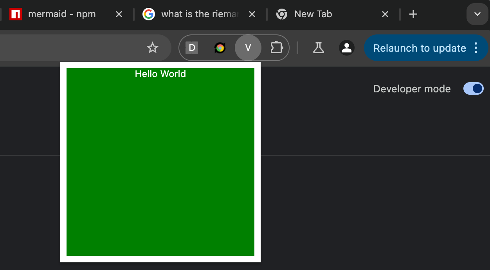

# Contents

After publishing my first article on [building a Chrome Extension using React, TypeScript, TailWind, and Webpack](https://joemuller.com/posts/create-a-chrome-extension-with-react-typescript-and-tailwindcss/), a handful of people commented that Webpack was an antique best left on the shelf. In this article, I will walk you through creating the a Chrome Extension that uses the same tech stack but with Vite as the build tool.

For the full code, check out the [GitHub repository](https://github.com/jtmuller5/cotr_react_chrome_extension_vite).

## Introduction

In this tutorial, we’ll build a Chrome extension using React, TypeScript, Tailwind CSS, and [Vite](https://vite.dev/). Vite is a modern build tool that offers a fast and lean development experience. By the end of this guide, you’ll have a fully functional Chrome extension with a popup and side panel, all powered by React components styled with [Tailwind CSS](https://tailwindcss.com/).

Prerequisites

	•	Node.js and npm installed
	•	Basic understanding of React and TypeScript
	•	Familiarity with Chrome extensions is helpful but not required

## Creating a Popup

### 1. Create the React App with Vite

[Use Vite to scaffold a new React project with TypeScript](https://vite.dev/guide/#scaffolding-your-first-vite-project) support:

```bash
npm create vite@latest react-chrome-ext -- --template react-ts
cd react-chrome-ext
```

This will create a new project named react-chrome-ext using the React TypeScript template.

### 2. Install Dependencies

Navigate to the project directory and install the dependencies:

```bash
npm install
npm install --save-dev @types/node
npm install --save-dev vite-plugin-static-copy
```

### 3. Update App.tsx

Open `src/App.tsx` and replace its content with:

```ts
function App() {
  return (
    <div className="App">
      Hello World
    </div>
  );
}

export default App;
```

### 4. Update index.css

Replace the content of src/index.css with:

```css
.App {
  color: white;
  text-align: center;
}

.SidePanel {
  background-color: #282c34;
  color: blue;
  padding: 1rem;
  width: 20%;
  height: 100vh;
  position: fixed;
  top: 0;
  left: 0;
}

.container {
  width: 15rem;
  height: 15rem;
  background-color: green;
}
```

### 5. Modify main.tsx

Update `src/main.tsx` to properly render the app in the Chrome extension context:

```tsx
import React from 'react';
import ReactDOM from 'react-dom/client';
import App from './App';
import './index.css';

const rootElement = document.createElement('div');
rootElement.className = 'container';
document.body.appendChild(rootElement);

ReactDOM.createRoot(rootElement).render(
  <React.StrictMode>
    <App />
  </React.StrictMode>
);
```

### 6. Create the manifest.json File

At the root of your project, create a `manifest.json` file with the following content:

```json
{
  "manifest_version": 3,
  "name": "React Chrome Extension with Vite",
  "version": "1.0.0",
  "description": "A Chrome extension built with React, TypeScript, Tailwind CSS, and Vite",
  "action": {
    "default_popup": "index.html",
    "default_title": "React Chrome Extension"
  }
}
```

### 7. Configure Vite for Chrome Extension Build

#### 7.1 Update vite.config.ts

Create or modify `vite.config.ts` at the root of your project. We will use the [vite-plugin-static-copy](https://www.npmjs.com/package/vite-plugin-static-copy) plugin to copy the manifest into the `/dist` (distribution) folder:

```ts
import { defineConfig } from 'vite';
import react from '@vitejs/plugin-react';
import { resolve } from 'path';
import { viteStaticCopy } from 'vite-plugin-static-copy'

export default defineConfig({
  plugins: [
    react(),
    viteStaticCopy({
      targets: [
        {
          src: 'manifest.json',
          dest: ''
        }
      ]
    })
  ],
  build: {
    outDir: 'dist',
    rollupOptions: {
      input: {
        popup: resolve(__dirname, 'index.html')
      },
      output: {
        entryFileNames: '[name].js',
        chunkFileNames: '[name].[hash].js',
        assetFileNames: '[name].[ext]'
      }
    }
  }
});
```

#### 7.2 Adjust index.html

Ensure `index.html` is correctly set up:

```html
<!DOCTYPE html>
<html lang="en">
  <head>
    <meta charset="UTF-8" />
    <title>React Chrome Extension</title>
  </head>
  <body>
    <!-- Vite will replace this with your app -->
    <script type="module" src="/src/main.tsx"></script>
  </body>
</html>
```

### 8. Build the Extension

Run the build command to generate the extension files in the `/dist` directory:

```bash
npm run build
```

### 9. Load the Extension in Chrome

•	Open Chrome and navigate to chrome://extensions.
•	Enable “Developer mode” if it’s not already enabled.
•	Click “Load unpacked” and select the dist directory from your project.

Your extension should now be loaded. Click the extension icon to see your popup with the green box and “Hello World” message.



## Creating a Side Panel

Let’s add a side panel to the extension.

### 1. Install the Chrome Types

Since we will be using the global chrome namespace in our TypeScript project, we need to install the appropriate types:

```bash
npm i @types/chrome
```

### 2. Create a Background Service Worker

Create a new file `src/background.ts`:

```ts
chrome.runtime.onInstalled.addListener(() => {
  chrome.sidePanel.setPanelBehavior({ openPanelOnActionClick: true });
});

export {};
```

### 3. Update manifest.json

Modify `manifest.json` to include the background service worker and side panel. I also removed the `action` field:

```json
{
  "manifest_version": 3,
  "name": "React Chrome Extension with Vite",
  "version": "1.0.0",
  "description": "A Chrome extension built with React, TypeScript, Tailwind CSS, and Vite",
  "permissions": ["sidePanel"],
  "background": {
    "service_worker": "background.js"
  },
  "side_panel": {
    "default_path": "sidepanel.html"
  }
}
```

### 4. Create the Side Panel Component

Create `src/SidePanel.tsx`:

```ts
function SidePanel() {
  return <div className="SidePanel">Side Panel</div>;
}

export default SidePanel;
```

### 5. Create sidepanel.html

Add a new HTML file `sidepanel.html` at the _root_:

```html
<!DOCTYPE html>
<html lang="en">
  <head>
    <meta charset="UTF-8" />
    <title>Side Panel</title>
  </head>
  <body>
    <script type="module" src="/src/index.tsx"></script>
  </body>
</html>
```

### 6. Create index.tsx

Create `src/index.tsx` to render the SidePanel component:

```ts
import React from 'react';
import ReactDOM from 'react-dom/client';
import SidePanel from './SidePanel';
import './index.css';

const rootElement = document.createElement('div');
rootElement.className = 'container';
document.body.appendChild(rootElement);

ReactDOM.createRoot(rootElement).render(
  <React.StrictMode>
    <SidePanel />
  </React.StrictMode>
);
```

### 7. Update vite.config.ts

Modify `vite.config.ts` to include the new entry point for the side panel and the background script:

```ts
import { defineConfig } from "vite";
import react from "@vitejs/plugin-react";
import { resolve } from "path";
import { viteStaticCopy } from 'vite-plugin-static-copy'

export default defineConfig({
  plugins: [
    react(),
    viteStaticCopy({
      targets: [
        {
          src: "manifest.json",
          dest: "",
        },
      ],
    }),
  ],
  build: {
    outDir: 'dist',
    rollupOptions: {
      input: {
        popup: resolve(__dirname, 'index.html'),
        sidepanel: resolve(__dirname, 'sidepanel.html')
        background: resolve(__dirname, "src/background.ts"),
      },
      output: {
        entryFileNames: '[name].js',
        chunkFileNames: '[name].[hash].js',
        assetFileNames: '[name].[ext]'
      }
    }
  }
});
```

### 8. Build and Reload the Extension

Rebuild the extension:

```bash
npm run build
```

Reload the extension in Chrome:
	•	Go back to chrome://extensions.
	•	Click the “Reload” button for your extension.

Now, when you click the extension icon, it should open the side panel displaying “Side Panel”.

## Organize Your Project

Organizing your project files enhances maintainability.

### 1. Create a background Folder

Move `background.ts` to `src/app/background.ts`.

### 2. Update `vite.config.ts`

Update the path in `vite.config.ts`:

```ts
export default defineConfig({
  // ... previous config
  build: {
    // ... previous build options
    rollupOptions: {
      input: {
        popup: resolve(__dirname, 'index.html'),
        sidepanel: resolve(__dirname, 'sidepanel.html'),
        background: resolve(__dirname, 'src/app/background.ts')
      },
      // ... output options
    }
  }
});
```

### 3. Build and Reload

Rebuild and reload the extension to ensure everything works as expected.

## Add More Features

### 1. Create an Options Page

#### 1.1 Create src/features/options/Options.tsx

```ts
function Options() {
  return (
    <div className="Options">
      <h1>Extension Options</h1>
    </div>
  );
}

export default Options;
```

#### 1.2 Create src/features/options/index.tsx

```ts
import React from 'react';
import ReactDOM from 'react-dom/client';
import Options from './Options';
import "../../index.css";

ReactDOM.createRoot(document.getElementById('root') as HTMLElement).render(
  <React.StrictMode>
    <Options />
  </React.StrictMode>
);
```

#### 1.3 Create options.html

Add `options.html` at the _root_:

```html
<!DOCTYPE html>
<html lang="en">
  <head>
    <meta charset="UTF-8" />
    <title>Extension Options</title>
  </head>
  <body>
    <div id="root"></div>
    <script type="module" src="/src/features/options/index.tsx"></script>
  </body>
</html>
```

### 1.4 Update manifest.json

Add the options page:
```json
{
  // ... existing manifest content
  "options_page": "options.html"
}
```

#### 1.5 Update vite.config.ts

Include the options page in the build inputs:

```
rollupOptions: {
  input: {
    popup: resolve(__dirname, 'index.html'),
    sidepanel: resolve(__dirname, 'sidepanel.html'),
    options: resolve(__dirname, 'options.html')
  },
  // ... output options
}
```

### 2. Build and Reload

Rebuild and reload the extension to include the new options page.

## Communicate Between Components

Use Chrome’s messaging API to enable communication between different parts of your extension.

### 1. Sending a Message from Options

In `Options.tsx`:

```tsx
function Options() {
  const sendMessage = () => {
    chrome.runtime.sendMessage(
      { type: 'GREETING', payload: 'Hello from Options' },
      (response) => {
        console.log('Response:', response);
      }
    );
  };

  return (
    <div className="Options">
      <h1>Extension Options</h1>
      <button onClick={sendMessage}>Send Message</button>
    </div>
  );
}

export default Options;
```

### 2. Receiving the Message in Side Panel

In `SidePanel.tsx`:

```tsx
import { useEffect } from 'react';

function SidePanel() {
  useEffect(() => {
    chrome.runtime.onMessage.addListener((message, sender, sendResponse) => {
      if (message.type === 'GREETING') {
        console.log('Received message in Side Panel:', message.payload);
        sendResponse({ message: 'Hello from Side Panel' });
      }
    });
  }, []);

  return <div className="SidePanel">Side Panel</div>;
}

export default SidePanel;
```

### 3. Build and Test

Rebuild the extension, reload it, and test the messaging functionality.

## Add Tailwind CSS

Integrate Tailwind CSS to style your components.

### 1. Install Tailwind CSS

```bash
npm install -D tailwindcss postcss autoprefixer
```

### 2. Initialize Tailwind CSS

```bash
npx tailwindcss init -p
```

This creates `tailwind.config.js` and `postcss.config.js`.

### 3. Configure tailwind.config.js

Update the content property:

```js
module.exports = {
  content: ['./index.html', './sidepanel.html', './options.html', './src/**/*.{js,ts,jsx,tsx}'],
  theme: {
    extend: {},
  },
  plugins: [],
};
```

### 4. Include Tailwind Directives

Replace the contents of `src/tailindexwind.css` with this:

```css
@tailwind base;
@tailwind components;
@tailwind utilities;
```

### 5. Update the Components

In your component files, you can now use the Tailwind classes. Here is an updated `SidePanel.tsx`:

```tsx
function SidePanel() {
  return <div className="SidePanel bg-red-400 p-4">Side Panel</div>;
}

export default SidePanel;
```

### 6. Update Vite Config for CSS

Ensure your Vite config supports CSS processing. Vite handles this by default, so no additional configuration is needed.

### 7. Build and Verify

Rebuild the extension and verify that Tailwind CSS styles are applied correctly.

## Conclusion

Using Vite simplifies the development of Chrome extensions with React and TypeScript. The integration with Tailwind CSS allows for rapid UI development with utility-first styling.

Happy coding! ☕️