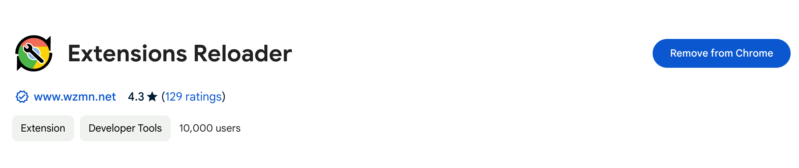
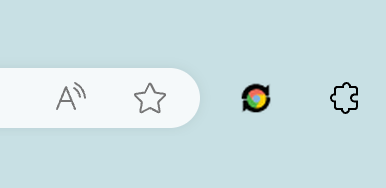

# Contents

Developing is hard. Developing in an environment that makes it difficult to see your changes in realtime is impossible (or at least it should be made illegal). This article explores a few ways to quickly see your changes while developing a Chrome extension.

## Use Extensions Reloader

There is a Chrome extension called [Extensions Reloader](https://chromewebstore.google.com/detail/extensions-reloader/fimgfedafeadlieiabdeeaodndnlbhid) that allows you to reload all unpacked extensions using the extension's toolbar button. 



After installing the extension, pin it to your toolbar for easy access. To test, make a change in your application code and then tap the Extensions Reloader icon to see your updates instantly. 




> Solutions inspired by this [Stack Overflow question](https://stackoverflow.com/questions/2963260/how-do-i-auto-reload-a-chrome-extension-im-developing)

If you are coming here from my other article on developing a Chrome extension using React, TypeScript, Tailwind, and Webpack, you can use this extension in combination with the following script in your `package.json`:

```diff
"scripts": {
    "build": "webpack --config webpack.config.js",
+   "watch": "webpack -w --config webpack.config.js"
},
```
Run the following command in the terminal to auto rebuild your extension as you work:

```bash
npm run watch
```

Then, simply hit the Extensions Reloader icon and your changes should appear.

> This method isn't exactly _instantaneous_. You'll still need to wait for your extension to finish building before reloading.

## Use a Script

