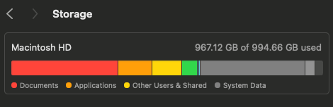
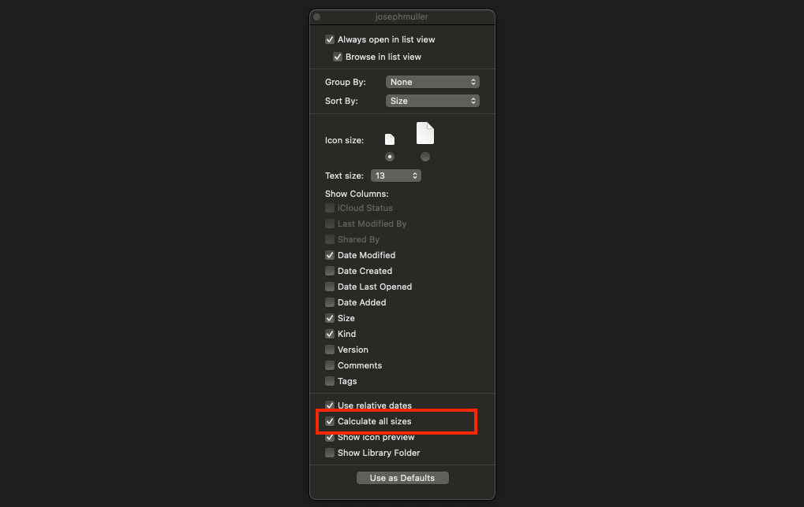
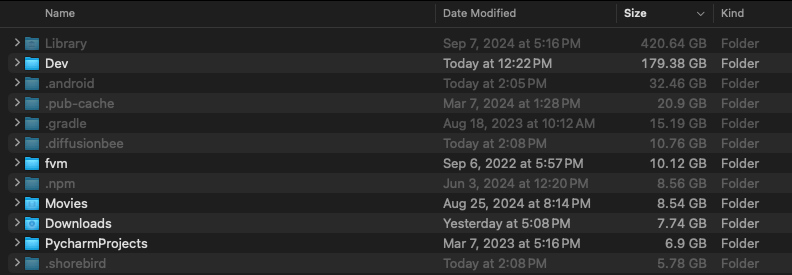

I've owned my Macbook Pro for a little over 2 years. Somewhere along the way, between starting a gazillion side projects, downloading half of pub.dev, and poorly managing my Xcode installation, I nearly maxed out my storage.



This blog will document the multitude of ways I clawed back the gigabytes.

## Identifying the Problems

Without knowing which folders on your machine are taking up the most space, its impossible to get started cleaning things up. Luckily, there's an easy way to find the culprits. In Finder, navigate to View > Show View Options > Calculate all sizes and check that bad boy:



Once its checked, it will slowly start to calculate the size of every folder in the current directory. I've noticed that the checkbox resets if you navigate to a different directory so for best results, open your user folder, check it, and wait. The size column will populate over time:



## Cleaning CoreSimulator (80 GB)

The Library/Developer/CoreSimulator folder on my machine was taking up 127.85 GB of space and for what? I don't know. A fast way to clear the filth is to run the following [command](https://stackoverflow.com/a/36305450/12806961) in your terminal:

```bash
xcrun simctl delete unavailable
```

This command removes simulator devices that are no longer supported and when I say its fast, I mean _fast_. In less than a second, my CoreSimulator folder size was cut down to 69.26 GB. But that's still a lot of GBs.

To delete additional unused devices, you can first run this command to find all devices:

```bash
xcrun simctl list devices
```

And then this command to delete devices one at a time:

```bash
xcrun simctl delete <device udid>
```

## Deleting XCode Caches (25 GB)

In the Settings app, navigate to Storage > Developer and click the information icon next to Developer. In the window that opens, select the XCode Caches item and click delete.

## Deleting Pub Cache (20 GB)

