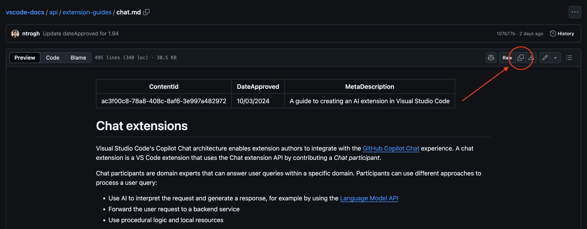
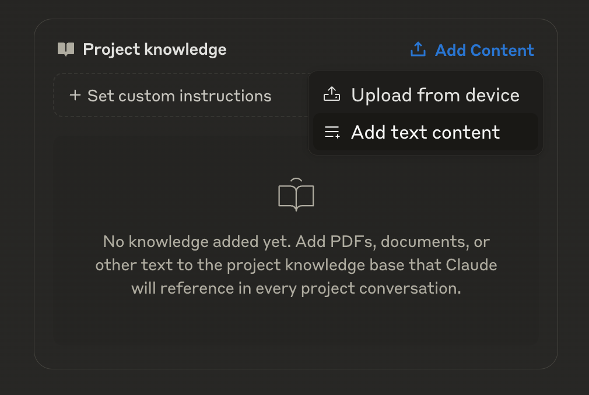
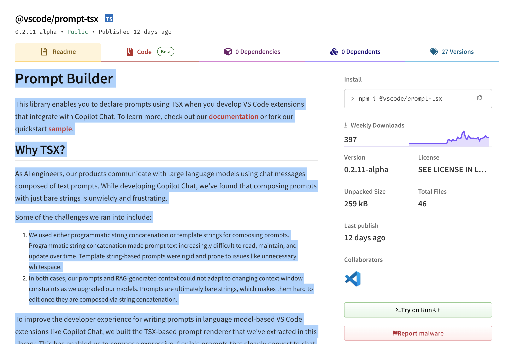
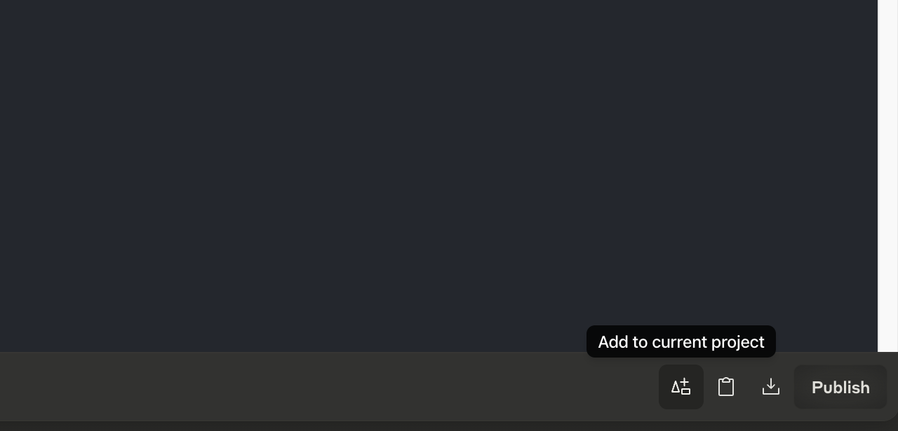

Claude Sonnet is undeniably one of the best frontier models for programming and I still reach for it despite having GPT-4o and o1 inside my VS Code editor. To make it even smarter and more effective, I use the Projects feature (available on the pro plan) to manage all of the documentation and general context related to what I'm working on. By uploading text and files related to the technology I'm using, Claude becomes a genius in exactly what I want him to be a genius in.

Below is the list of resources I upload whenever I'm building a VS Code chat extension:

## Extension Guide: Chat

The [Chat page](https://github.com/microsoft/vscode-docs/blob/main/api/extension-guides/chat.md) in the VS Code extension docs covers just about everything that's unique to developing a chat extension: participants, commands, variables, and more. Conveniently, everything is hosted on GitHub in markdown pages so you can open each page and click the copy icon to get everything on your clipboard in one go.



Now move back to Claude Projects and click the "Add Content" button in the Project knowledge box. Click "Add text content" and paste everything:



## Extension Guide: Language Model

The [Language Model docs](https://github.com/microsoft/vscode-docs/blob/main/api/extension-guides/language-model.md) contain a lot of good information about using the built-in copilot models, formulating requests, designing prompts, and managing context. Add this to Claude projects the same way you added the Chat docs above.

I normally only add these two pages to my context but you can find all of the VS Code extension guides on the [vscode-docs GitHub project](https://github.com/microsoft/vscode-docs/tree/main/api/extension-guides).

## @vscode/prompt-tsx

The VS Code team created an NPM package for storing your prompts in .tsx files called [@vscode/prompt-tsx](https://www.npmjs.com/package/@vscode/prompt-tsx?activeTab=readme). I have yet to find the GitHub page for this library but simply copying the contents of the libraries Readme and pasting it into Claude works well.



## Project Repopack

Finally, to keep Claude grounded in what I'm currently working on, I typically use the [repopack](https://github.com/yamadashy/repopack) command line tool to pack my entire codebase into a repopack-output.txt file. This tool is straightforward to use. To start, install it:

```bash
npm install -g repopack
```

And then just run the repopack command in your project:

```bash
repopack
```

This will generate a `repopack-output.txt` file that contains all of the files in your project formatted in a way that is easy for LLMs to understand. If your entire codebase is too large or contains a lot of repetitive information, you can run `repopack --init` to create a config file for customizing which files and folders are included in the output.

## Summary

With this documentation and project context added to a Claude Project, I guarantee you'll feel several multiples faster while developing a VS Code chat extension. The documentation (excluding the project repopack) takes up less than 10% of Claude's project knowledge, leaving a majority of the available space for code specific to what you want to build. What's also cool is that you can directly add artifacts created by Claude to your project knowledge by clicking this icon at the bottom of any artifact: 



Projects does not yet let you replace existing project knowledge with updated versions so you'll need to delete and readd content as it changes but that's a small price to pay for insane development speeds. 

Happy coding 🍻