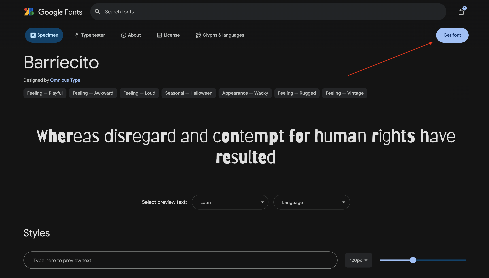
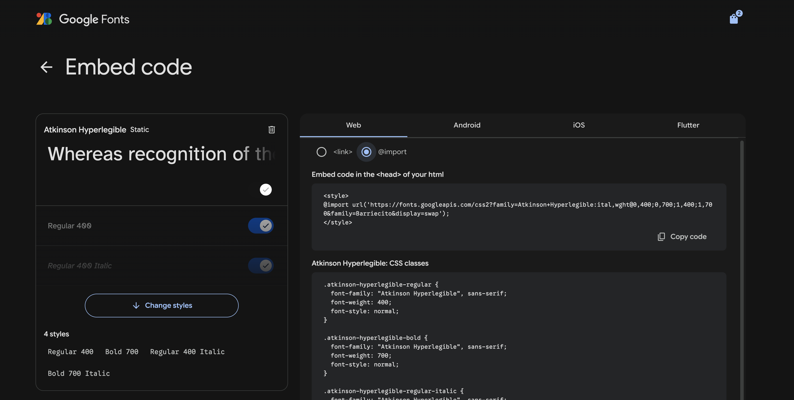

# Contents

I've been working on a handful of web apps made stylish by TailwindCSS but was a bit disappointed that I couldn't easily figure out how to use a Google Font in place of the default font. This tutorial fixes that.

## Find your Font

Go to [Google Fonts](https://fonts.google.com/) and search for the font that fits your project. Once you've found it, click the "Get Font" button at the upper right of the screen:



Then click "Get embed code". On the screen that pops up, make sure the "Web" tab is selected and then choose the "@import" radio button:



> [!WARNING]
> If you have multiple fonts in your bag, the embed page will have all of them listed

Copy the entire `@import` line for the next step.

## Configure your Font

In your Tailwind project, navigate to your `index.css` file and paste the `@import` statement at the top.

Next, add an `@theme` section and define your fonts using the family name in the import URLs. If the family name includes a "+", replace it with a space. For example:

```css
@import url('https://fonts.googleapis.com/css2?family=Barriecito&display=swap');
@import url('https://fonts.googleapis.com/css2?family=Atkinson+Hyperlegible:ital,wght@0,400;0,700;1,400;1,700&family=Barriecito&display=swap');
@import "tailwindcss";

@plugin "@tailwindcss/typography";
@plugin "daisyui"{
  themes: light --default, dark --prefersdark, lemonade;
}

@theme {
  --font-barriecito: "Barriecito", cursive; 
  --font-atkinson: "Atkinson Hyperlegible", sans-serif; 
}
```

## Set your Font

Now that your theme has been updated, navigate to wherever you add global styles to your app (ex. `App.tsx` or a shared Layout component). Add the `--font-<family>` directive.

```tsx
const Layout: React.FC<LayoutProps> = ({ children, showSidebar = true }) => {

  // At the top level of your Layout component
  return (
    <div className="font-atkinson">
        ...
    </div>)
}       
```

You can read more about configuring [Tailwind Font Families](https://tailwindcss.com/docs/font-family).