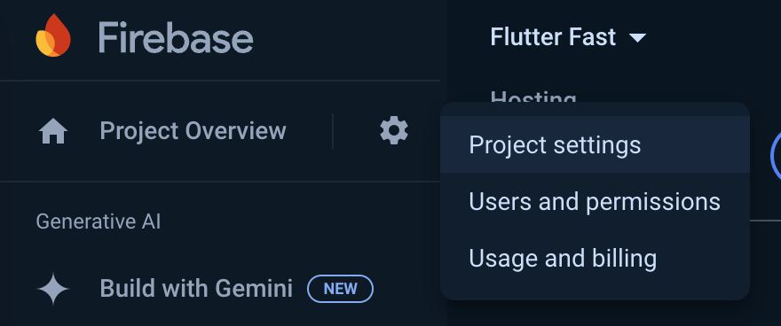

As soon as a Flutter project gains traction (or I've convinced myself that it will eventually gain traction), I like to set up a CI/CD pipeline so I can focus more on app development and less on manually deploying all of my changes to prod. This article in particular will provide an overview of the Github workflow I typically use for my Flutter projects that use [Firebase Hosting](https://firebase.google.com/docs/hosting).

# The Basics

For the simplest projects that don't require environments, variables, or Slack notifications, the workflow is straightforward. Below is an outline of what it does:
1. Checks out the repository ([actions/checkout@v4](https://github.com/actions/checkout))
2. Installs Flutter ([subosito/flutter-action@v2](https://github.com/subosito/flutter-action))
3. Installs Flutter dependencies
4. Builds the Flutter web app
5. Deploys the web app to Firebase Hosting([FirebaseExtended/action-hosting-deploy@v0](https://github.com/FirebaseExtended/action-hosting-deploy))

Create a new YAML file under `.github/workflows` and paste in the following:

```yaml
name: Build and Deploy Flutter App to Firebase Hosting

on:
  push:
    branches:
      - main

jobs:
  deploy:
    runs-on: macos-latest
    steps:
      - name: Checkout repository
        uses: actions/checkout@v4

      - name: "Install Flutter"
        uses: subosito/flutter-action@v2
        with:
          flutter-version: "3.22.1"
          channel: "stable"

      - name: Install dependencies
        run: flutter pub get

      - name: "Build web app"
        run: "flutter build web --web-renderer html"
      - name: "Deploy web app to Firebase hosting"
        id: "web"
        uses: FirebaseExtended/action-hosting-deploy@v0
        with:
          repoToken: "${{ secrets.GITHUB_TOKEN }}"
          firebaseServiceAccount: "${{ secrets.FIREBASE_SERVICE_ACCOUNT_FLUTTER }}"
          projectId: "my-firebase-project-id"
          channelId: "live"
```

In order for this to work, you'll first need a Firebase project which you can create through the Firebase console. Once created, you can find the ID of the project in "Project Settings".



After you've created a Firebase project, you can [create a service account](https://github.com/FirebaseExtended/action-hosting-deploy?tab=readme-ov-file#firebaseserviceaccount-string-required) by running this command in your terminal:

```bash
firebase init hosting:github
```

This will prompt you for the user and repository name that you want to connect and will subsequently create a new [secret](https://docs.github.com/en/actions/security-for-github-actions/security-guides/using-secrets-in-github-actions) in your Github repo containing the Firebase service account JSON key. Add the new secret to this line in the Github workflow:

```yaml
firebaseServiceAccount: "${{ secrets.FIREBASE_SERVICE_ACCOUNT_FLUTTER }}"
```

and make sure the `projectId` is set to your Firebase project ID. At this point, you should be good to go. Pushing a change to the `main` branch of your repo will kick off a build and deploy of your Flutter web app.

# Advanced Topics

## Secrets

If your app depends on private environment variables/secrets, you can easily pass them into the `flutter build` command using `--dart-define`. Start by creating a new repository secret in Github (repo -> settings -> actions -> secrets) and then reference it in your workflow file like this:

```
      - name: "Build web app"
        run: "flutter build web --web-renderer html
          --dart-define=AMPLITUDE_API_KEY=${{ secrets.AMPLITUDE_API_KEY }}"
```

## Environments

> Only available on public repos or private repos with a paid Github plan

Github supports [environments](https://docs.github.com/en/actions/managing-workflow-runs-and-deployments/managing-deployments/managing-environments-for-deployment) so you can create separate sets of secrets/variables for your development, staging, and production environments. Once an environment is created, you can reference it in your workflow files. If a workflow file uses an environment, all references to `secrets` variables will use the values in the specified environment.

In Github, navigate to the settings tab of your repo and select "Environments" from the side menu. Tap the plus icon to add a new environment (ex. "development") and then add your secrets for that environment.

To reference the environment in your workflow file, specify it under the `environment` section. You can also specify a website for each environment using the `url` field and this link will appear everywhere you can see workflow runs (on the repository home page, on the actions tab, etc).

```
jobs:
  deploy:
    runs-on: macos-latest
    environment:
      name: development
      url: https://my-app.com/
```

## Slack Notification

If you're using Slack and want to be notified when a workflow finishes, create a new [Slack app](https://api.slack.com/apps) and pop this bad boy at the end of your workflow file and update the Firebase URL and `MY_SLACK_APP_URL` variable. When the app is deployed, a message with the latest commit message will be sent to the Slack channel you specify.

```
      - name: "Prepare commit message"
        id: "slack-prepare"
        run: |
          COMMIT_MESSAGE="${{ github.event.head_commit.message }}"
          COMMIT_MESSAGE="$(echo "$COMMIT_MESSAGE" | sed -E ':a;N;$!ba;s/\r{0,1}\n/\\n/g')"
          echo "commit-message=${COMMIT_MESSAGE}" >> $GITHUB_ENV
      - name: "Notify Slack channel of new web builds"
        uses: slackapi/slack-github-action@v1.26.0
        with:
          payload: |
            {
                "blocks": [{
                        "type": "header",
                        "text": {
                            "type": "plain_text",
                            "text": "New App Deployment (Development)",
                            "emoji": true
                        }
                    },
                    {
                        "type": "section",
                        "text": {
                            "type": "mrkdwn",
                            "text": "*Git Commit*"
                        }
                    },
                    {
                        "type": "section",
                        "text": {
                            "type": "mrkdwn",
                            "text": "${{ env.commit-message }} - ${{ github.event.head_commit.url }}"
                        }
                    }
                ],
                "attachments": [{
                    "color": "#A6F2B8",
                    "blocks": [
                        {
                            "type": "section",
                            "text": {
                                "type": "mrkdwn",
                                "text": "*Firebase Hosting*: ${{ steps.web.outputs.details_url != '' && steps.web.outputs.details_url || 'https://my-app.web.app/' }}"
                            }
                        }
                    ]
                }]
            }
        env:
          SLACK_WEBHOOK_URL: "MY_SLACK_APP_URL"
          SLACK_WEBHOOK_TYPE: INCOMING_WEBHOOK
```