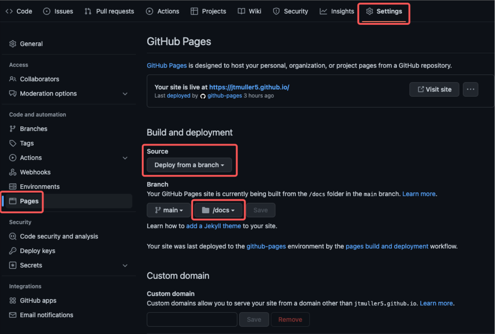
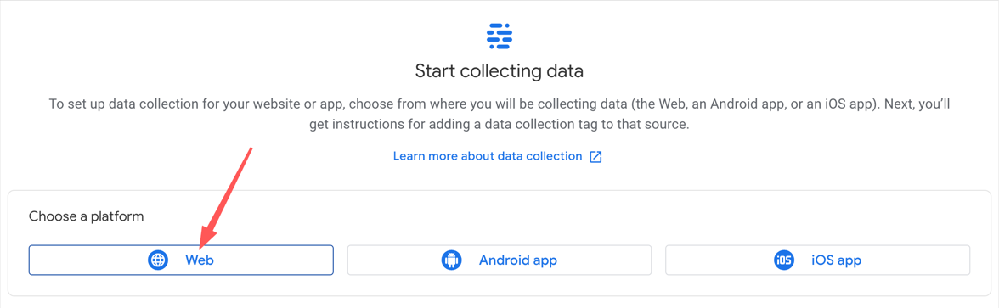

# Build this Blog
Medium. Hashnode. Wordpress. Ghost. Log Rocket.

There are a thousand blogging platforms that want your content, knowledge, and time. I say nay! In this article I'll lay out all the steps you need to build this exact website and host your 
content on 
GitHub pages.

What you'll get:

- [x] A blogging website hosted on GitHub
- [x] The Hugo PaperMod theme
- [x] Menus to filter content by categories and tags
- [x] Full text search
- [ ] Tracking with Google Analytics

[](https://www.youtube.com/watch?v=2MsN8gpT6jY)

# Steps
## Create your Site

Github allows individuals to create one free site per account. Luckily, that's all we need!

1. Create a new repository


2. Name the repository \<your username>.github.io
3. Navigate to the settings tab and select the Pages section
4. Configure the site to "Deploy from a branch" and select the "/docs" folder


The official GitHub pages tutorial can be found [here](https://docs.github.com/en/pages/quickstart).

## Create a New Blog Post
Now that you have the repo setup, we can start adding content.

As a rule of thumb, each blog post should be stored in its own folder since a post may consist of a markdown file and a bunch of images. Each time you add an image to a post it will be stored in 
the same folder as the .md file.
```aidl
hugo new content/posts/build_this_blog/build_this_blog.md
```

## Import Posts from Medium
If you're arriving at this article after writing a handful of posts for other sites, you're first order of business should be to move your blogs from there to here. 

I personally did most of my 
writing on Medium before making the move so the majority of my content migration was done using the [medium-to-markdown](https://www.npmjs.com/package/medium-to-markdown) CLI. To get started:
1. Ensure you have npm installed
2. Run the following: `npm i medium-to-markdown`
3. Create a new directory to hold the markdown content
4. (Optional) Uncheck the box to Meter your story on Medium
5. cd into the directory where the medium-to-markdown package was installed
6. Run the following command:
```aidl
npm run convert <URL_TO_YOUR_MEDIUM_POST> <PATH_TO_YOUR_NEW_POST_FILE>

// Example
npm run convert https://medium.com/@jtmuller5-98869/enhanced-enums-in-flutter-3-c6b6b4716e43 > /Users/josephmuller/Dev/apps/jtmuller5.github.io/content/posts/enhanced_enums/enhanced_enums.md
```

## Add your Social Links

## Add Tags and Categories to your Post

## Add Google Analytics
[Hugo has internal templates for Google Analytics tracking.](https://gohugo.io/templates/internal/#google-analytics)
1. Create a Google Analytics account here: https://analytics.google.com/
2. Select the "Admin" icon along the side bar
3. Create a new property. Give it a name, a category, and select how you intend to use Google Analytics
4. Select "Create". On the next screen, select the "Web" option

5. Add the name of your GitHub site in the Website URL field (ex. jtmuller5.github.io)
6. Name the stream and select "Create Stream"
7. Locate the _Measurement ID_ and copy it. In GA3 this was known as the _Tracking ID_
8. In your repo, add the following line to your config.yaml
```yaml
googleAnalytics: <MEASUREMENT ID> 
```
---
> The PaperMod theme includes a head.html file in `<ROOT>/themes/PaperMod/layouts/partials/head.html`. This file includes the code required to add Google Analytics tracking in a _production_ environment
# Resources
- [GitHub Pages Quickstart](https://docs.github.com/en/pages/quickstart)
- [Hugo](https://gohugo.io/)
- [Hugo PaperMod Theme](https://github.com/adityatelange/hugo-PaperMod)
- [Add Google Analytics to Hugo](https://gideonwolfe.com/posts/sysadmin/hugo/hugogoogleanalytics/)
