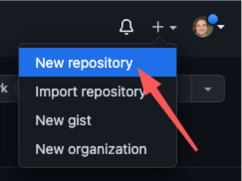

# Build this Blog
Medium. Hashnode. Wordpress. Ghost. 

There are a thousand blogging platforms that want your content. I say nay! In this article I'll lay out all the steps you need to build this exact website and host your content on GitHub.

# Steps
## Create Your Site
> The official GitHub pages tutorial can be found [here](https://docs.github.com/en/pages/quickstart)

Github allows individuals to create one free site per account. Luckily, that's all we need! 

1. Create a new repository




## Create a New Blog Post
As a rule of thumb, each blog post should be stored in its own folder since a post may consist of a markdown file and a bunch of images. Each time you add an image to a post it will be stored in 
the same folder that the .md file is located in.
```aidl
hugo create content posts/build_this_blog/build_this_blog.md
```

## Add Tags and Categories to your Post

# Resources
- [GitHub Pages Quickstart](https://docs.github.com/en/pages/quickstart)
- [Hugo](https://gohugo.io/)
- [Hugo PaperMod Theme](https://github.com/adityatelange/hugo-PaperMod)
