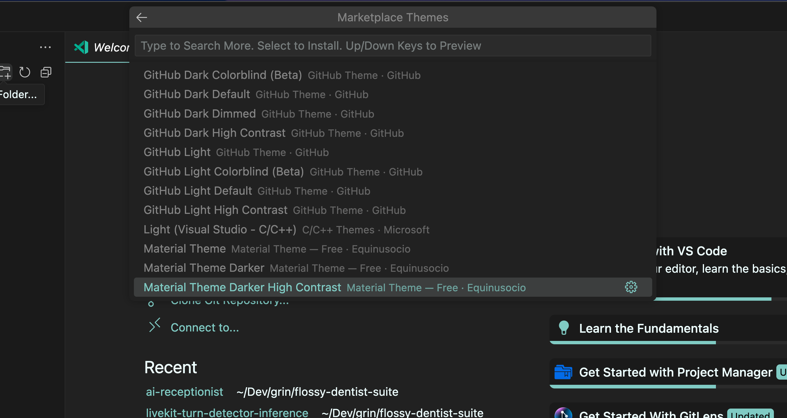

In VS Code, you can use the `Browse Color Themes in Marketplace` command to quickly peruse through hundreds of popular VS Code themes. Just use the up and down arrow keys to preview each theme in the list. Hit enter to download and apply it:

