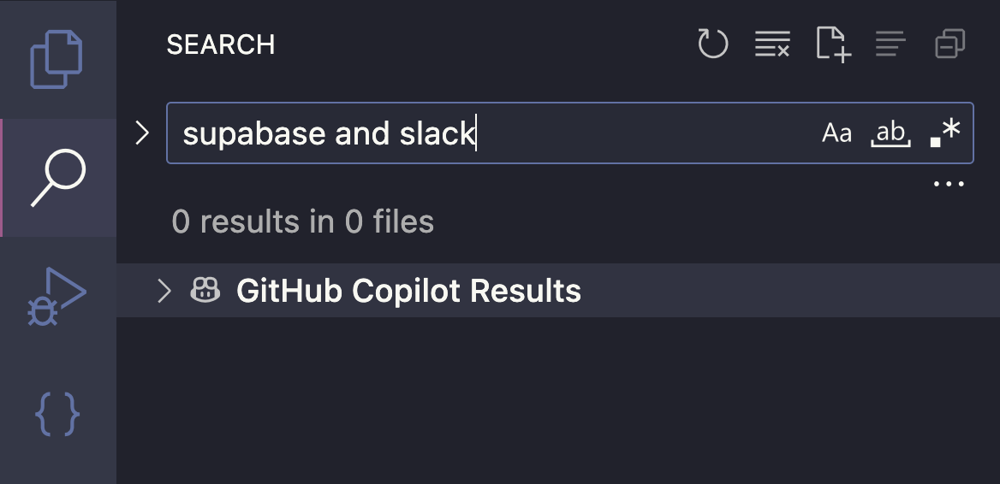

There is a [new experimental setting](https://code.visualstudio.com/docs/copilot/copilot-settings#_general-settings) for VS Code's copilot that lets you enable semantic search in the search window.

```
github.copilot.chat.search.semanticTextResults
```


Once you enable the semantic search setting, you'll see a new dropdown under the search results in the search panel. Expanding the dropdown will show you the semantic search results (after a few seconds of processing).



> [!CAUTION]
> I've noticed that this works better in non-blog projects. In my Hugo blog (this website), the search results miss things that seem obvious.

> [!CAUTION]
> These semantic search results don't seem to respect your `ignore` search settings.