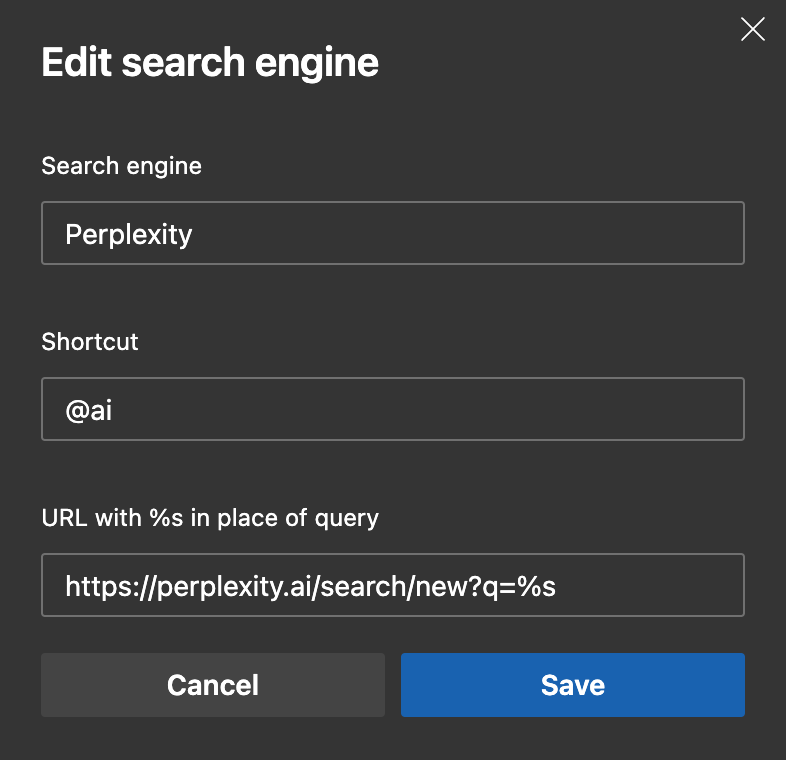

# Just the Steps
1. Open settings
2. Search for "address bar" (Privacy, search, and services -> Address bar and search)
3. Select "Manage search engines"
4. Select "Add"
5. Fill in the fields with the following information:
    - Search engine: Perplexity
    - Shortcut: @ai
    - URL with %s in place of query: https://perplexity.ai/search/new?q=%s
6. Click "Save"
7. Click the three dots next to Perplexity and select "Make default"

If you don't want to set Perplexity as your default search engine, you can still use it by typing "@ai" in the address bar followed by your search query.
