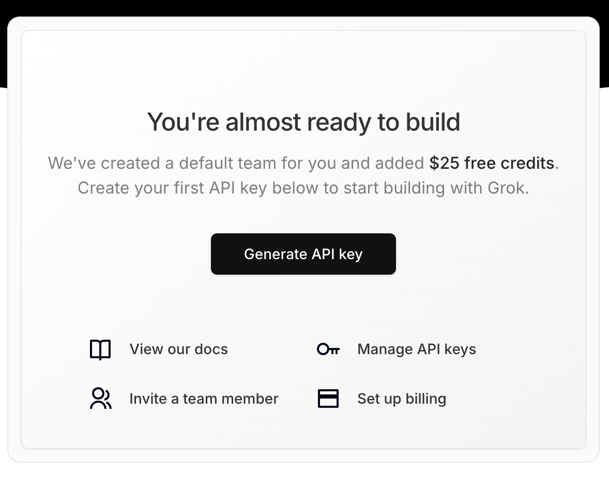

# November 5, 2024

## Building an AI Chatbot with xAI

[xAI just released their API](https://x.com/xai/status/1853505214181232828) and through the end of the year you can get $25 in credits each month. I took it for a quick spin and set up a chatbot using NextJS and Deepgram.

The first step was to create an xAI account and generate an API key:


Then, spin up a quick NextJS web page that uses the [AI SDK](https://sdk.vercel.ai/).

```bash
npm i ai
```

You can use the xAI SDK with the AI SDK even though it's not an officially supported provider. To do this, just use the `customOpenAI` constructor from the OpenAI provider. Here's my full API route:

```typescript
// app/api/chat/route.ts
import { NextResponse } from 'next/server';
import { CoreMessage, generateText } from 'ai';
import { createOpenAI, openai } from '@ai-sdk/openai';
import { groq } from '@ai-sdk/groq';
import { anthropic } from '@ai-sdk/anthropic';

interface RequestBody {
  messages?: CoreMessage[];
  provider: 'openai' | 'groq' | 'anthropic' | 'xai';
  model: string;
}

export async function POST(request: Request) {
  try {
    const body: RequestBody = await request.json();
    const { messages, provider, model } = body;

    if (!messages) {
      throw new Error('Messages must be provided');
    }

    console.log('Messages: ', messages);

    let aiModel;
    let customModel;
    switch (provider) {
      case 'openai':
        aiModel = openai(model);
        break;
      case 'groq':
        aiModel = groq(model);
        break;
      case 'anthropic':
        aiModel = anthropic(model);
        break;
      case 'xai':
        customModel = createOpenAI({
          baseURL: "https://api.x.ai/v1",
          apiKey: process.env.XAI_API_KEY,
        })
        break;
      default:
        throw new Error('Invalid provider: ' + provider);
    }

    const { text } = await generateText({
      model: provider == 'xai'? customModel!(model) : aiModel!,
      messages: messages,
    });

    return NextResponse.json({ 
      message: text,
      provider,
      model
    });

  } catch (error) {
    console.error('AI Generation error:', error);
    return NextResponse.json(
      { error: error instanceof Error ? error.message : 'Failed to generate response' },
      { status: 500 }
    );
  }
}
```

## Stealing Customers The Easy Way

One thing that struck me as genius while working on this project was [xAI's OpenAI "integration"](https://docs.x.ai/api/integrations#openai-sdk). Basically, they let you swap out the `baseUrl` and `apiKey` arguments in the OpenAI client and everything just works:

```javascript
import OpenAI from "openai";
const openai = new OpenAI({
  apiKey: "<api key>",
  baseURL: "https://api.x.ai/v1",
});

const completion = await openai.chat.completions.create({
  model: "grok-beta",
  messages: [
    { role: "system", content: "You are Grok, a chatbot inspired by the Hitchhiker's Guide to the Galaxy." },
    {
      role: "user",
      content: "What is the meaning of life, the universe, and everything?",
    },
  ],
});

console.log(completion.choices[0].message);
```

Groq API also took the [same approach](https://console.groq.com/docs/openai):

```javascript
import OpenAI from "openai";

const client = new OpenAI({
  apiKey: process.env.GROQ_API_KEY,
  baseURL: "https://api.groq.com/openai/v1"
});
```

At this point in the game, every player that isn't OpenAI should take this approach. Sharing the SDK means stealing engineers, customers, and brain space without doing much of anything. Not only that, but you can instantly become the B half of an A/B test in thousands of AI applications.