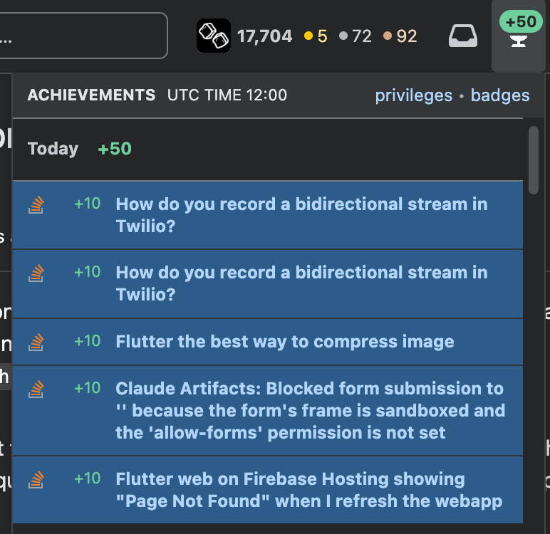

There are not many social media websites that reward you for objectively useful behavior. Twitter rewards yapping, Instagram rewards deceptive perspective, LinkedIn rewards slop.

Stack Overflow, on the other hand, rewards knowledge that leads to problem solving. Despite the green badge impacting my life just as much as a red or blue badge, the green badge on the SO trophy raises my dopamine levels just a little higher.

The question for the AGI spotted world is what new platform will produce the same quality of dopamine?