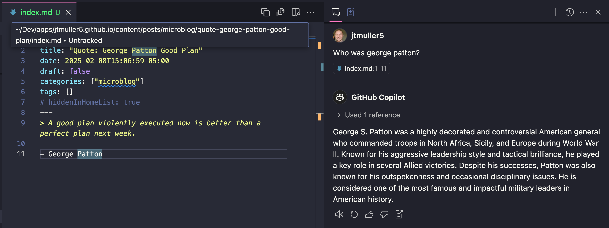

Since VS Code is built for rapidly searching and navigating files, it seems like the ideal tool to turn into a note-taking app. Even better, the integration of copilot directly into VS code makes it even better since you could hypothetically ask the AI model of your choice questions about your content by tagging it in the chat panel (that is, if the models allows non-coding questions, which they didn't at one point).

