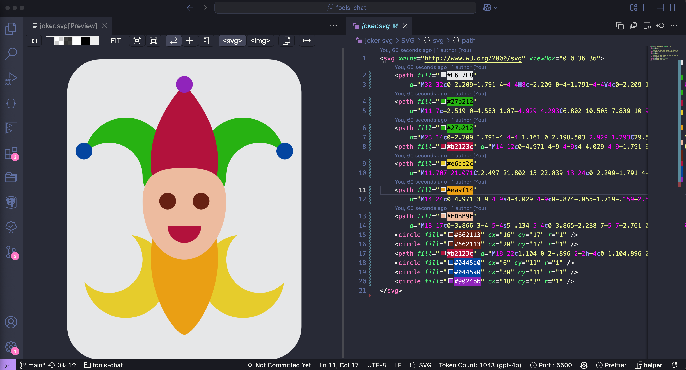

I spent 3-4 hours creating a Flutter app to edit and export SVGs only to find a VS Code extension that does both of these things in a few clicks.

The extension is simply called [SVG](https://marketplace.visualstudio.com/items?itemName=jock.svg) and it has almost 2 million downloads. The best part is that it allows you to edit SVGs directly in the editor and export them as PNGs. 

After installing the extension, right-click on one of your PNGs and select "Preview SVG" to start editing. This will open a new tab with the SVG preview and a toolbar at the top. In the toolbar, select the "Code interactive" button and click on any element in the SVG to start editing it. This will open a panel on the left with the SVG code.

To export, just click the "Export PNG" icon all the way to the right.