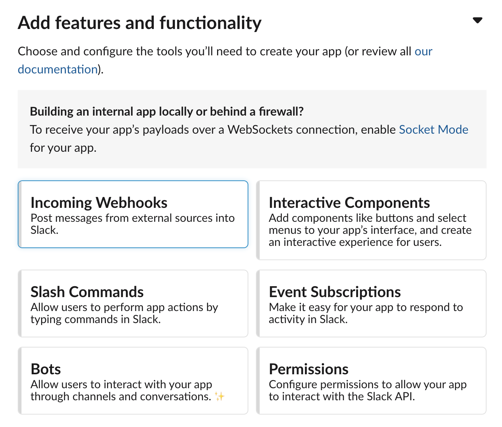
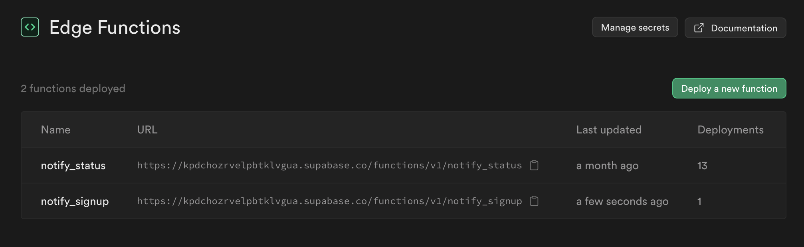
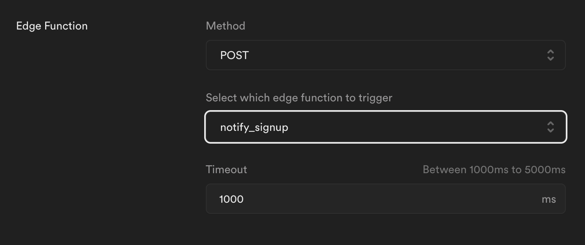

# Slack

## 1. Create a new Slack channel
Create a slack channel in your workspace where the notifications will be displayed (ex. "notifications")

## 2. Create a Slack app
Visit the [Slack API](https://api.slack.com/apps) webpage and "Create New App". Give the app a name and select the Slack workspace you're working with. 
## 3. Configure the Slack app
Select "Incoming Webhooks" and flip the "Active Incoming Webhooks" switch on. 


## 4. Create the webhook 
Add New Webhook to Workspace and select the "notifications" channel you created before.
  
  Copy the new Webhook URL:
```
https://hooks.slack.com/services/T063WTUDTK9/B06FGB5RVGX/TBno97298ba9RobFq4jZD2
```

___
# Edge Function

## 1. Create a new Supabase Edge Function 
Instructions can be found at Edge Functions -> Deploy a new function
```bash
supabase functions new notify_signup
```
This creates a function in the `supabase/functions/` folder. 

## 2. Create a .env file 
In the `supabase` folder, add a `.env` file with your Slack webhook URL:

```
SLACK_WEBHOOK_URL="{YOUR WEBHOOK URL}"
```

## 3. Write the function
Add the following code to the new `index.ts`:
```typescript
Deno.serve(async (req) => {
  const { record } = await req.json();
  console.log("user", record)
  
  var slackWebhookUrl = Deno.env.get("SLACK_WEBHOOK_URL");

  const slackMessage = {
    text: `New user signed up: ${record.email}`,
  }

  const slackResponse = await fetch(slackWebhookUrl, {
    method: "POST",
    body: JSON.stringify(slackMessage),
  })

  return new Response(
    JSON.stringify(record),
    { headers: { "Content-Type": "application/json" } },
  )
})
```

## 4. Deploy the function
To deploy the function, run Docker Desktop and then execute this command
```bash
supabase functions deploy notify_signup --project-ref kpdchozrvelpbtklvgua 
```

You should now see your function in the Edge Functions section of the Supabase dashboard:


___
# Webhook

## 1. Create the webhook
Create Supabase webhook under database -> webhooks

## 2. Configure the webhook
Select Supabase Edge Functions as the `Type` and select the edge function you just created in the "Edge Function" section:


## 3. Secure the webhook
Also add an authorization header to the webhook using the dropdown under "HTTP Headers". If you do not do this and your edge function requires JWT authentication (the default), the function will not be called.