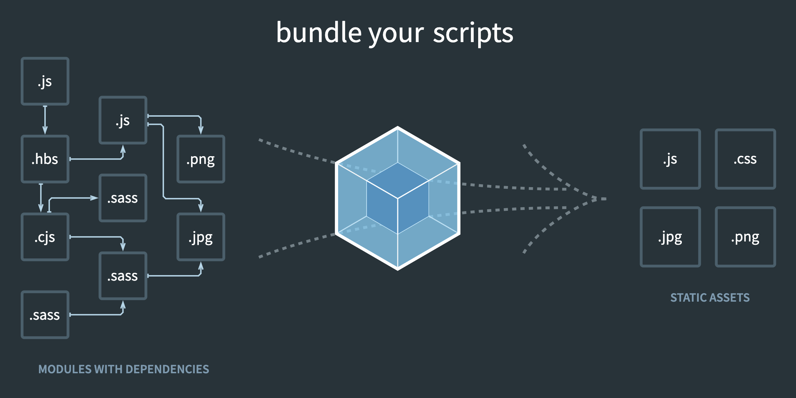

[Webpack](https://en.wikipedia.org/wiki/Webpack) is a static module bundler built for JavaScript. It's goal is to bundle your JavaScript app into an optimized set of files that can be sent to the browser. [JavaScript modules](https://developer.mozilla.org/en-US/docs/Web/JavaScript/Guide/Modules) allow developers to break large applications into smaller and easier to maintain chunks of code. Prior to Webpack, developers had to manually import modules while considering dependency load order, global scope pollution, and general dependency management between multiple modules.

[Webpack](https://webpack.js.org/) is included in the [create-react-app](https://github.com/facebook/create-react-app) template and is therefore the bundler of choice for React developers.



To install webpack and its related developer tools, run the following command:

```bash
npm i webpack webpack-dev-server webpack-cli
```

Webpack is the bundler. The Webpack dev server allows you to build your application with hot reload. The [Webpack CLI](https://webpack.js.org/api/cli/) is used to configure and interact with your build.

You can determine how Webpack bundles your project by adding a `webpack.config.js` [configuration file](https://webpack.js.org/guides/getting-started/#using-a-configuration) at the root of your project.

Modern competitors to Webpack include [Vite](https://vite.dev/) and [Turpopack](https://turbo.build/), both which claim to bundle JavaScript applications faster.