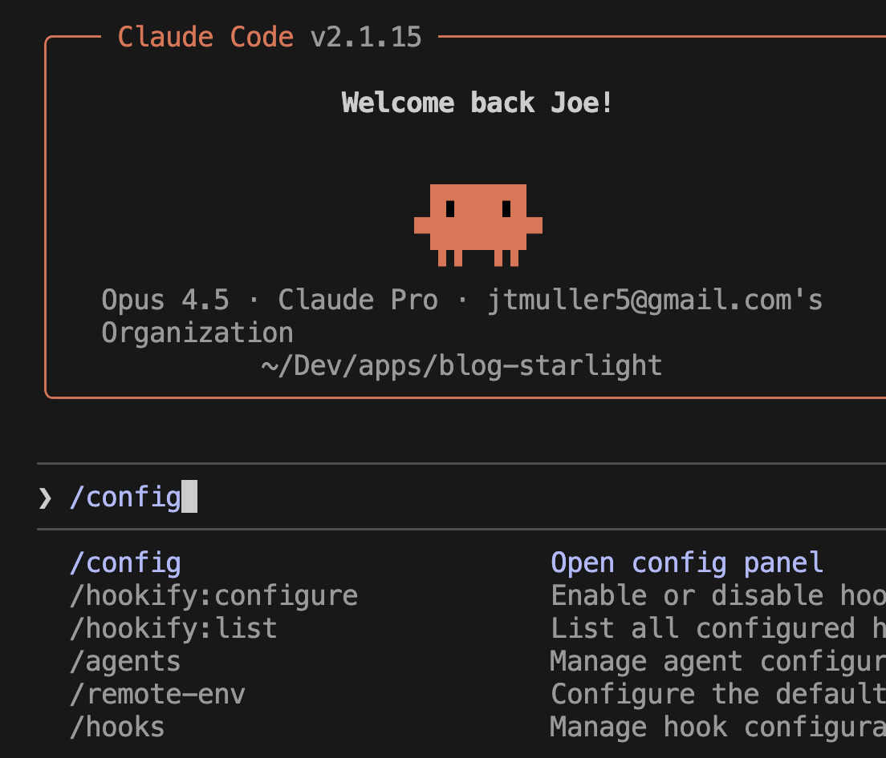
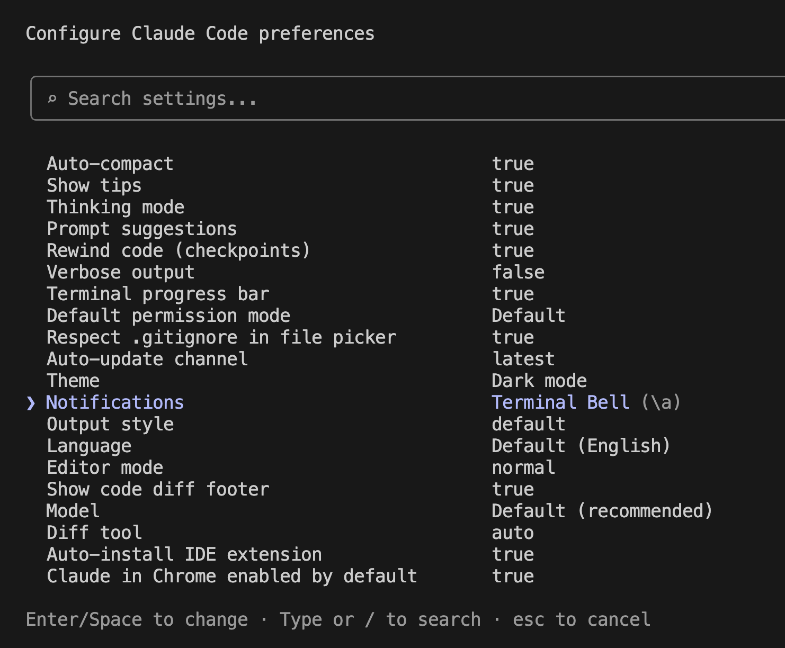
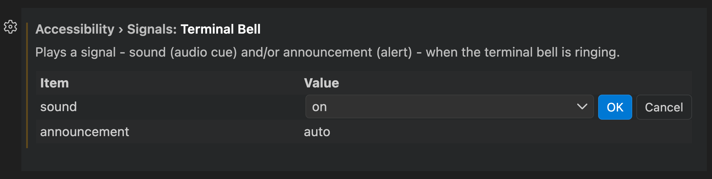

## Introduction

If the [creator of Claude Code has notifications](https://x.com/bcherny/status/2007179833990885678) for when Claude has finished a task, so should you.

### VS Code - Claude Code Extension

https://github.com/anthropics/claude-code/issues/6091

### VS Code - Claude Code

#### Terminal Bell

#### Hook

You can create a hook that listens for the [Stop](https://code.claude.com/docs/en/hooks#stop) event.

https://code.claude.com/docs/en/terminal-config#notification-setup
