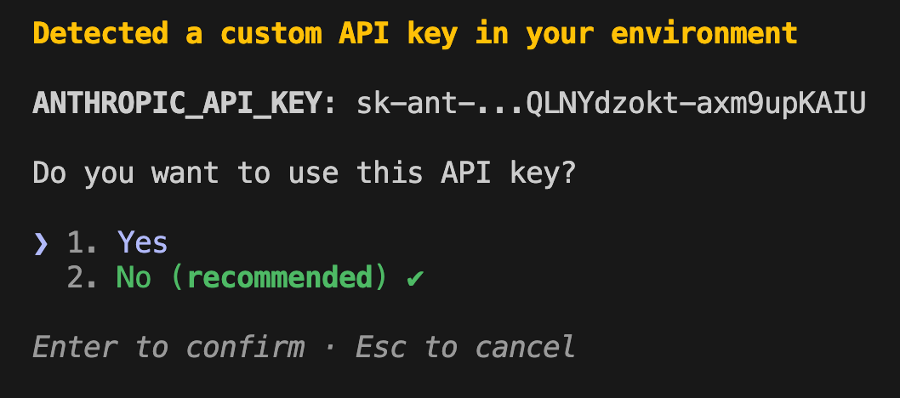

You can run Claude Code with a custom LLM by configuring an [LLM gateway here](https://code.claude.com/docs/en/llm-gateway).

```bash
export ANTHROPIC_BASE_URL=http://my-host:8000
export ANTHROPIC_API_KEY=dummy 
export ANTHROPIC_DEFAULT_OPUS_MODEL=my-model 
export ANTHROPIC_DEFAULT_SONNET_MODEL=my-model 
export ANTHROPIC_DEFAULT_HAIKU_MODEL=my-model 

claude
```

When Claude first opens, you will see a warning "screen" asking if you want to use the custom API key. Say yes.



## Gemini

Gemini does not have an Anthropic-capatible endpoint so you will need to run a LiteLLM proxy to use it. To start, pull the docker image:

```bash
docker pull docker.litellm.ai/berriai/litellm:main-latest
```

Next, create a `litellm_config.yaml` file where you can configure how requests are routed. You can find valid model options [here](https://ai.google.dev/gemini-api/docs/models).:

```yaml
general_settings:
  master_key: sk-1234

model_list:
  - model_name: gemini-2.5-pro
    litellm_params:
      model: gemini/gemini-2.5-pro
      api_key: os.environ/GEMINI_API_KEY
  - model_name: gemini-2.5-flash
    litellm_params:
      model: gemini/gemini-2.5-flash
      api_key: os.environ/GEMINI_API_KEY
```

Then, run the docker image with your Gemini API key:

```bash
docker run \
      -v $(pwd)/litellm_config.yaml:/app/config.yaml \
      -e GEMINI_API_KEY=YOUR_API_KEY \
      -p 4000:4000 \
      docker.litellm.ai/berriai/litellm:main-latest \
      --config /app/config.yaml --detailed_debug
```

Finally, set the Anthropic environment variables and run Claude Code. The models you use should directly align with the ones in your  `litellm_config.yaml` file:

```bash
export ANTHROPIC_BASE_URL=http://localhost:4000
export ANTHROPIC_API_KEY=sk-1234
export ANTHROPIC_DEFAULT_OPUS_MODEL=gemini-2.5-pro 
export ANTHROPIC_DEFAULT_SONNET_MODEL=gemini-2.5-flash
export ANTHROPIC_DEFAULT_HAIKU_MODEL=gemini-2.5-flash 

claude
```


## Troubleshooting

/Users/josephmuller/Dev/litellm/litellm_config.yaml

https://github.com/anthropics/claude-code/issues/20199

