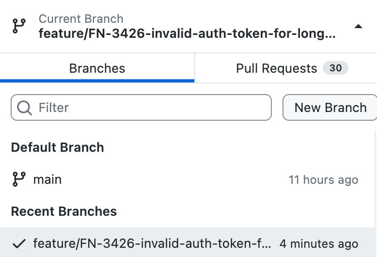
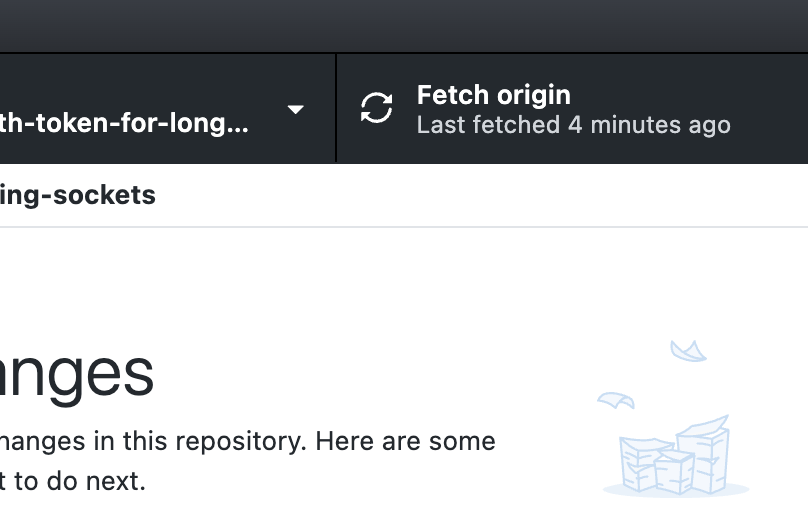
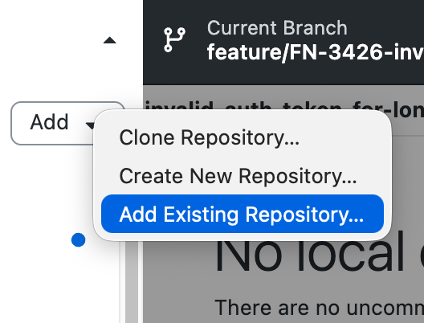
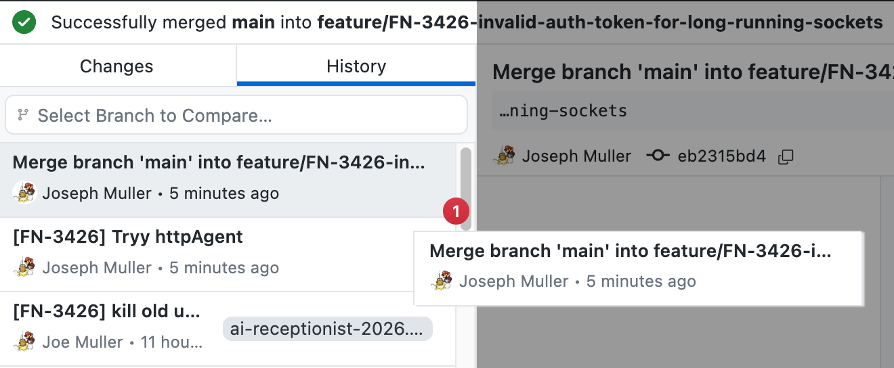
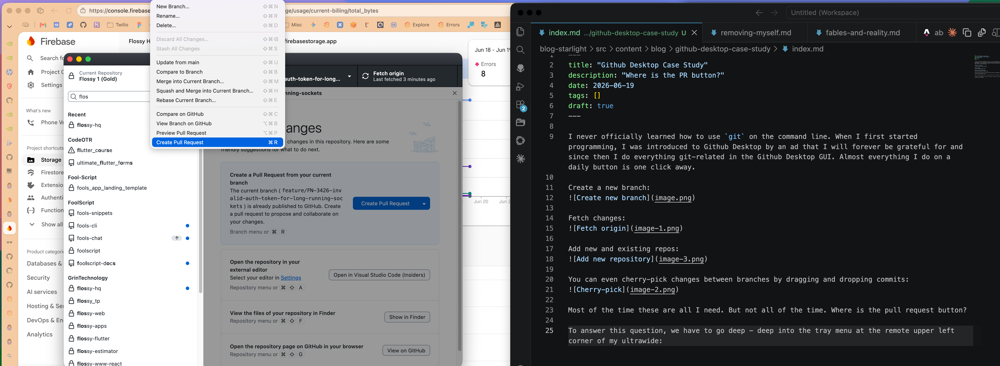
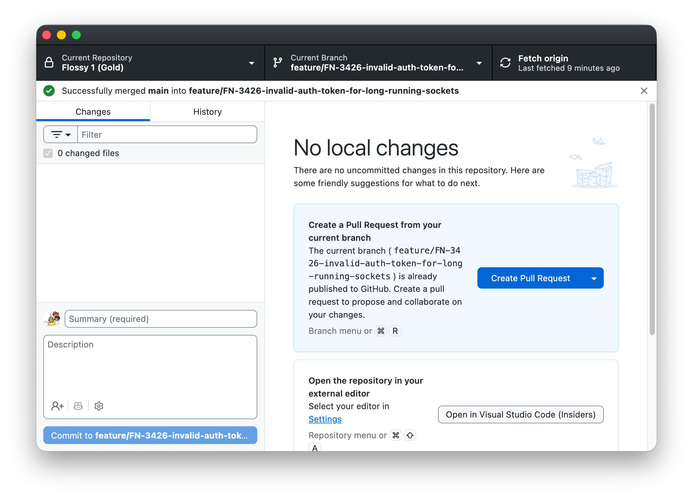

I never officially learned how to use `git` on the command line. When I first started programming, I was introduced to Github Desktop by an ad that I will forever be grateful for and since then I do everything git-related in the Github Desktop GUI. Almost everything I do on a daily button is one click away.

Create a new branch:


Fetch changes:


Add new and existing repos:


You can even cherry-pick changes between branches by dragging and dropping commits:


Most of the time these are all I need. But not all of the time. Where is the pull request button?

To answer this question, we have to go deep - deep into the tray menu at the remote upper left corner of my ultrawide:


There are several issues with this positioning. First, it is no where near the button I press 95% of the time before creating a pull request (Push origin). Second, it is inside a menu that requires mild dexterity to click. Third, it is at the very bottom of the menu. Fourth, the menu is only available when the Github Desktop app is in focus.

The process of committing my latest changes and creating a PR for them is thus a marathon for my cursor and by extension, my wrist.
1. Commit changes (bottom left of window)
2. Push origin (top right of window)
3. Create PR (top left of screen -> bottom of menu)

And sure, there is a keyboard shortcut for creating a pull request (Cmd + R) but I rarely have both hands on my keyboard since my Saber mouse has 12 keys configured for various common tasks. I want to click whenever clicking accomplishes my task. 

As I'm writing this, I realize there is a giant blue button titled "Create Pull Request" in the space where the diff would appear when there is no diff...and that is honestly pretty nice...


But it doesn't reduce the three step workflow (four if you count opening the Github Desktop application).

If I were designing Github desktop, I would add a smaller button next to the commit button for the full shebang: Commit + Push + PR.

Until then, I have created a user-level VS Code task that can do it all:
```json
{
    "version": "2.0.0",
    "tasks": [
        {
            "label": "Commit + Push + PR",
            "icon": {
                "id": "repo-push",
                "color": "terminal.ansiGreen"
            },
            "type": "shell",
            "command": "git add -A && git commit -m \"${input:commitMessage}\" && git push -u origin HEAD && (gh pr create --fill || true) && gh pr view --web",
            "problemMatcher": [],
            "presentation": {
                "reveal": "always",
                "panel": "shared",
                "clear": true
            }
        }
    ],
    "inputs": [
        {
            "id": "commitMessage",
            "type": "promptString",
            "description": "Commit message",
            "default": "Update ${fileBasename}"
        }
    ]
}
```

To be fair, this still requires 2 steps (opening the task menu and selecting the super task), but over the course of a year, I might save enough time to take a short walk. That walk may lead to me somewhere I've never been which may cause me to think a thought I've never thought. 