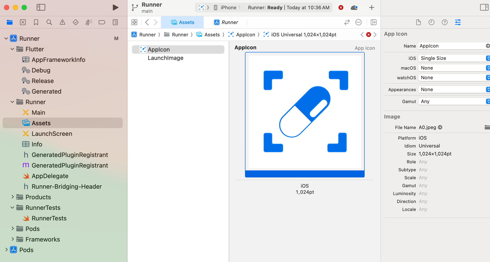

## Android

The easiest way to add app icons for Android is using Android Studio. 

1. Open the `android` folder of your Flutter project in Android Studio.
2. In the left sidebar, open the `app` folder.
3. Right-click on the `res` folder and select `New > Image Asset`.

4. On the "Configure Image Asset" dialog, select "Launcher Icons (Adaptive and Legacy)".
5. Choose your image file and adjust the settings as needed.
6. On the "Options" tab, under the "Icon Format" section, choose the `PNG` option. This will ensure that the correct icon is used in Firebase App Distribution.

7. Click "Next" and then "Finish" to generate the icons.

See the [official docs](https://docs.flutter.dev/ui/assets/assets-and-images#updating-the-app-icon) for a less useful walkthrough.

## iOS

1. Open the `ios` folder of your Flutter project in Xcode
2. Under Runner -> Runner, open the "Assets" activity
3. Select the "AppIcon" item from the list 
4. On the right panel, in the "Image" section, select your file where it says "File Name"
5. For best results, choose an image with a background (ex. .jpg)

Xcode will generate all of your app icons from a single asset.

Do NOT change the name of the asset from "AppIcon". Do NOT try to delete the AppIcon asset and add a new one. Just change the file.