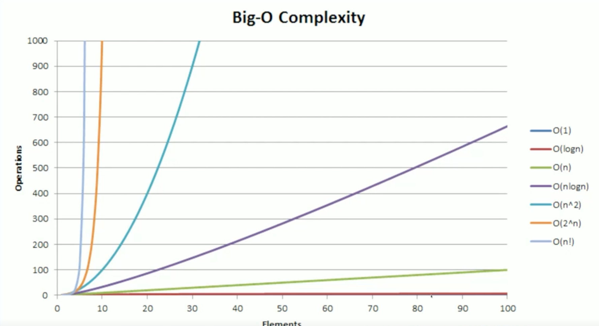

## Day 1
Main Topic: Sliding Window Problems

Resources:
- https://www.youtube.com/watch?v=1pkOgXD63yU&list=PLot-Xpze53leOBgcVsJBEGrHPd_7x_koV&index=1
- https://leetcode.com/problem-list/two-pointers/
- https://frontendmasters.com/courses/algorithms/trees-overview/
- https://frontendmasters.com/courses/algorithms/arrays-vs-linked-list/
- https://frontendmasters.com/courses/algorithms/big-o-time-complexity/
- https://frontendmasters.com/courses/algorithms/arrays-data-structure/

Problems:
- https://leetcode.com/problems/remove-duplicates-from-sorted-array/
- https://leetcode.com/problems/remove-element/

Key takeaways:
- Designate one pointer as the "builder" -> This builds the final solution
- Consider using "i-1" indexing
- Pay attention to the desired output type (number in this case). Use the "builder" index as the result

Both of these problems involve removing elements from an array. In one case we remove duplicates, in the other we remove a value. Both problems use the 2-pointer approach, starting at 0 and moving to the right.

Sliding Window problems are a subset of 2-pointer problems. Both have a time complexity of O(n).

Big O Time Complexity
- A generalized way to understand how the algorithm will react to changes
- O(n) - grows linearly based on input, for every additional input, there is "one" additional unit of work
- Count the loops
- Drop constants in O values. O(2N) -> O(N)
- Consider worst case
- O(1) < O(logn) < O(n) < O(nlogn) < O(n^2) < (2^n) 

Arrays
- O(1) for everything (add, remove)
- Allocate memory up front
- Would use this if you need to access items at any index

Linked List
- Memory usage is more optimized
- Linear search is only option (can't use binary search)
- Used when you want to push or pop from head or tail of a list

ArrayList
- Has length and capacity
- Push checks if new index is inside of capacity and then pushes and increments length - constant/O(1)
- Pop, retrieve value based on length and decrement length - constant/O(1)
- Enqueue/dequeue (pushing/popping from beginning of array) - O(n)
- Deleting at index - O(n)

Trees Overview
 - All programming eventually leads to trees
 - File system, the DOM, Abstract Syntax Tree
 - node<T>
  - value: T
  - children: []
- Branching from a single Node
- root: Top most node
- height: The longest path from the root to the most childish node
- binary tree: A tree with a maximum of 2 children at each node (left and right instead of children[])
- general tree: A tree with 0 or more children
- binary search tree: A tree with a specific ordering and at most 2 children
- leaves: child with no children
- balanced: A tree which is perfectly balanced when any node's left and right children have the same height
- branching factor: the amount of children a tree has