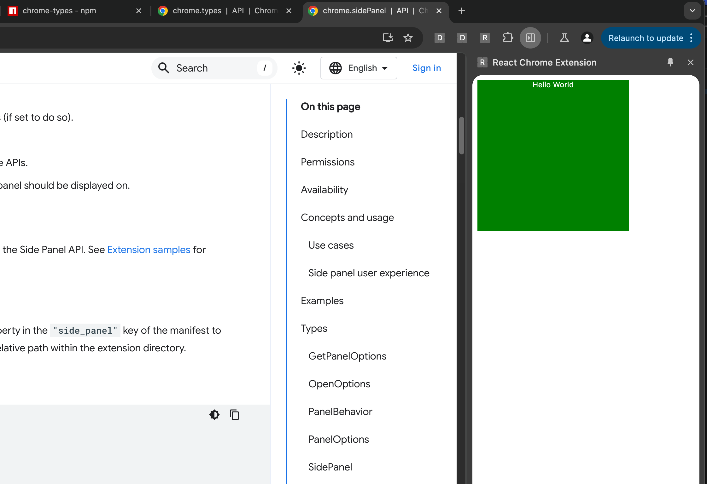
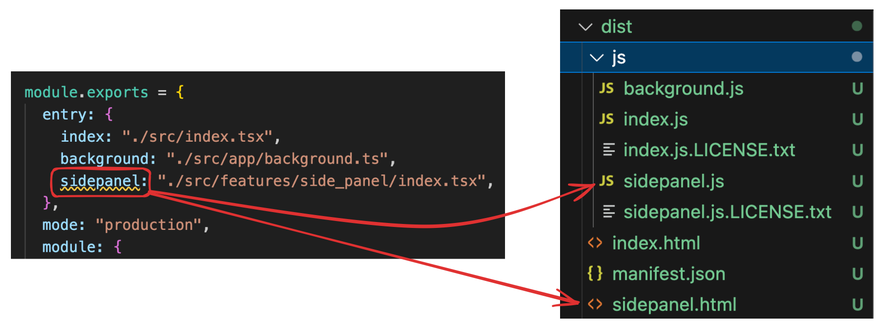

> This article was inspired by [Creating a Chrome Extension with React a Step by Step Guide](https://medium.com/@tharshita13/creating-a-chrome-extension-with-react-a-step-by-step-guide-47fe9bab24a1).

For the full code, check out the [repo](https://github.com/jtmuller5/cotr-react-chrome-extension-webpack).

## Creating a Popup
### 1. Create React App

Use the official Create React App CLI to kickstart your project:

```bash
npx create-react-app react-chrome-ext --template typescript
cd react-chrome-ext
```

### 2. Update the Files

Update `App.tsx` to show a simple string:

```typescript
function App() {
  return (
    <div className="App">
      Hello World
    </div>
  );
}

export default App;
```

Update `index.tsx`:

```typescript
import React from 'react';
import ReactDOM from 'react-dom/client';
import App from './App';
import "./App.css";

const root = document.createElement("div")
root.className = "container"
document.body.appendChild(root)
const rootDiv = ReactDOM.createRoot(root);
rootDiv.render(
  <React.StrictMode>
    <App />
  </React.StrictMode>
);
```

Update `App.css`:

```typescript
.App {
    color: white;
    text-align: center;
}

.container {
    width: 15rem;
    height: 15rem;
    background-color: green;

}
```

### 3. Install and Setup Webpack

Install Webpack:

```bash
npm install --save-dev webpack webpack-cli copy-webpack-plugin css-loader ts-loader html-webpack-plugin ts-node
```

Create a `webpack.config.js` file at the root of the project and add the following:

```js
const path = require("path");
const HTMLPlugin = require("html-webpack-plugin");
const CopyPlugin = require("copy-webpack-plugin")

module.exports = {
    entry: {
        index: "./src/index.tsx"
    },
    mode: "production",
    module: {
        rules: [
            {
              test: /\.tsx?$/,
               use: [
                 {
                  loader: "ts-loader",
                   options: {
                     compilerOptions: { noEmit: false },
                    }
                  }],
               exclude: /node_modules/,
            },
            {
              exclude: /node_modules/,
              test: /\.css$/i,
               use: [
                  "style-loader",
                  "css-loader"
               ]
            },
        ],
    },
    plugins: [
        new CopyPlugin({
            patterns: [
                { from: "manifest.json", to: "../manifest.json" },
            ],
        }),
        ...getHtmlPlugins(["index"]),
    ],
    resolve: {
        extensions: [".tsx", ".ts", ".js"],
    },
    output: {
        path: path.join(__dirname, "dist/js"),
        filename: "[name].js",
    },
};

function getHtmlPlugins(chunks) {
    return chunks.map(
        (chunk) =>
            new HTMLPlugin({
                title: "React extension",
                filename: `${chunk}.html`,
                chunks: [chunk],
            })
    );
}
```

Update the `package.json` file to have the following scripts:

```bash
  "scripts": {
    "build": "webpack --config webpack.config.js",
    "watch": "webpack -w --config webpack.config.js"
  }
```

### 4. Add the Manifest File

Chrome extensions require one file which is the `manifest.json`. At the root of your project create this and add the following content:

```json
{
    "version": "1.0.0",
    "manifest_version": 3,
    "name": "React Chrome Extension",
    "description": "This is a Chrome extension built with React and TypeScript",
    "action": {
        "default_popup": "js/index.html",
        "default_title": "React Chrome Extension"
    }
}
```

### 5. Build the App

Run `npm run build` to create your application in the `/dist` folder.

### 6. Load the Extension

In Chrome, navigate to [chrome://extensions](chrome://extensions) and select "Load Unpacked". Select the `/dist` directory.

You should now be able to open a page in chrome and click the extension icon in the upper right to display a big green popup. Okay, that's a good start.

## Creating a Side Panel

The process to create a Side Panel is fairly straightforward now that we have the basic infrastructure in place.

### 1. Install the Chrome Types

Since we will be using the global `chrome` namespace in our TypeScript project, we need to install the appropriate [types](https://www.npmjs.com/package/@types/chrome):

```bash
npm i @types/chrome
```

### 2. Create a Service Worker

In the `/src` directory of your project, create a `background.ts` file and add the following code:

```typescript
chrome.runtime.onInstalled.addListener(() => {
  chrome.sidePanel.setPanelBehavior({ openPanelOnActionClick: true });
});

export {}
```

### 3. Update the Manifest File

First, add the `sidePanel` permission to the permissions list. Next, add a `side_panel` field with a nested `default_path` argument that points to your `index.html` file. The updated Manifest file should look like this.

```json
{
  "version": "1.0.0",
  "manifest_version": 3,
  "name": "React Chrome Extension",
  "description": "This is a Chrome extension built with React and TypeScript",
  "permissions": [
    "sidePanel"
  ],
  "side_panel": {
    "default_path": "js/index.html"
  },
  "background": {
    "service_worker": "js/background.js"
  }
}
```

### 4. Update the Webpack Config

In your `webpack.config.js` file, add a new line to the entry object for the background script:

```js
 entry: {
        index: "./src/index.tsx",
        background: "./src/background.ts"
    },
```    

### 5. Build the Extension

Run `npm run build` again to update your extension.

### 6. Reload the Extension

In chrome, navigate to the chrome://extensions page again and reload the extension. Now when you click on the icon, it should open the side panel showing the same large green box.



## Organize your Project

If you have opinions on how to write software, you probably feel a strong pull to organize the files of your project. Normally this is effortless but not for React Chrome extensions. If you move a file in this project, you will need to update the `webpack.config.js` and (sometimes) the `manifest.json` files to point to the correct location.

### 1. Move the background.ts File

I like to put files that affect the entire app in an `/app` folder so I'll move the `background.ts` file there.

### 2. Update the Webpack Config

Now that we've transplanted the `background.ts` file, we need to tell the Webpack config where to find it:

```js
entry: {
        index: "./src/index.tsx",
        background: "./src/app/background.ts"
    },
```

In this case the `background.js` file will still be located at the same location in the `/dist` folder so we odn't have to update the `manifest.json`:

```json
"background": {
    "service_worker": "js/background.js"
  }
```

### 3. Build and Reload the Extension 

Running `npm run build` and refreshing the extension one more time should give us an extension that works the same as before. Clicking on the icon should open the side panel ✅

## Add More Folders

Where things get a bit more complicated is when you want to create separate React components for each part of your extension; side panel, options page, popup, etc. Just as with the `background.ts` file, you can move these other components anywhere but there are a few requirements to make it all work. 

Each component requires two files: an `index.tsx` and the component file (e.g. `SidePanel.tsx`).

### 1. Create the Files

For this example, I'll be creating my side panel component in the `/src/features/side_panel/` folder.

Create an `index.tsx` file:

```typescript
import React from 'react';
import ReactDOM from 'react-dom/client';
import SidePanel from './SidePanel';

const root = document.createElement("div")
root.className = "container"
document.body.appendChild(root)
const rootDiv = ReactDOM.createRoot(root);
rootDiv.render(
  <React.StrictMode>
    <SidePanel />
  </React.StrictMode>
);
```

Create a `SidePanel.tsx` file:

```typescript
function SidePanel() {
  return <div className="SidePanel">Side Panel</div>;
}

export default SidePanel;
```

### 2. Update the Webpack Config

We'll need to update the `entry` field in the Webpack config to point to the new side panel `index.tsx`. The value you add as the key in the map will determine where in the `/dist` folder the files are generated:



The value (on the left side) is where Webpack can find your file.

In addition to this change, you will also need to update the HTML Plugin configuration to add the `sidepanel`:

```diff
const path = require("path");
const HTMLPlugin = require("html-webpack-plugin");
const CopyPlugin = require("copy-webpack-plugin");

module.exports = {
  entry: {
    index: "./src/index.tsx",
    background: "./src/app/background.ts",
+   sidepanel: "./src/features/side_panel/index.tsx",
  },
  mode: "production",
  module: {
    rules: [
      {
        test: /\.tsx?$/,
        use: [
          {
            loader: "ts-loader",
            options: {
              compilerOptions: { noEmit: false },
            },
          },
        ],
        exclude: /node_modules/,
      },
      {
        exclude: /node_modules/,
        test: /\.css$/i,
        use: ["style-loader", "css-loader"],
      },
    ],
  },
  plugins: [
    new CopyPlugin({
      patterns: [{ from: "manifest.json", to: "manifest.json" }], // Adjusted path
    }),
+   ...getHtmlPlugins(["index", "sidepanel"]),
  ],
  resolve: {
    extensions: [".tsx", ".ts", ".js"],
  },
  output: {
    path: path.join(__dirname, "dist"),
    filename: "js/[name].js",
+   publicPath: "/",
  },
};

function getHtmlPlugins(chunks) {
  return chunks.map(
    (chunk) =>
      new HTMLPlugin({
        title: "React extension",
        filename: `${chunk}.html`,
        chunks: [chunk],
      })
  );
}
```

### 3. Update the Manifest File

Now that we've created a new `sidepanel.html` file in the `/dist` folder, we can use it in the `manifest.json`:

```diff
{
  "version": "1.0.0",
  "manifest_version": 3,
  "name": "React Chrome Extension",
  "description": "This is a Chrome extension built with React and TypeScript",
  "permissions": [
    "sidePanel"
  ],
+  "side_panel": {
+    "default_path": "sidepanel.html"
+  },
  "background": {
    "service_worker": "js/background.js"
  }
}
```

### 4. Build and Reload the Extension

Run `npm run build` one more time and reload the extension. Clicking on the extension icon should again open up the sidebar with the big green box, only this time you have a custom folder structure under the hood.

You can expand on this to add separate components for the Options page and Popup.

## Communicate Between Components

Since each component we've created runs in a separate context, we need to be creative with how they communicate with one another. One way to pass realtime data between them is using [Chrome's Messaging API](https://developer.chrome.com/docs/extensions/develop/concepts/messaging).

### 1. Create the Message Sender

In this example, I will be having my `Options.tsx` component send data to my `SidePanel.tsx` component. Here is the `Options.tsx`:

```typescript
function Options() {
  const sendMessage = () => {
    chrome.runtime.sendMessage(
      { type: "UPDATE_FROM_OPTIONS", payload: "Hello SidePanel" },
      (response) => {
        console.log("Response from SidePanel:", response);
      }
    );
  };

  return (
    <div className="App">
      Options
      <button onClick={sendMessage}>Send Message to SidePanel</button>
    </div>
  );
}

export default Options;
```

### 2. Create the Message Receiver

To receive the message, my `SidePanel.tsx` file will listen for all messages sent using `chrome.runtime`. Here is the `SidePanel.tsx`:

```typescript
function SidePanel() {
  useEffect(() => {
    chrome.runtime.onMessage.addListener((message, sender, sendResponse) => {
      if (message.type === "UPDATE_FROM_OPTIONS") {
        // Handle the message
        console.log("Received message in SidePanel:", message.payload);
        sendResponse({ status: "Received by SidePanel" });
      }
    });
  }, []);

  return <div className="App">Side Panel</div>;
}

export default SidePanel;
```

### 3. Reload and Test

After reloading the extension, first open the side panel by clicking on the extension icon. Then, right-click the icon and open the options page. From here, you should be able to press the button and send a message to the side panel (to see the console message, right click in the side panel and select "inspect").

### 4. Mediate Messages

If you need to mediate messages between components, use the background script:

```typescript
// In background.ts
chrome.runtime.onMessage.addListener((message, sender, sendResponse) => {
  if (message.type === 'UPDATE_FROM_OPTIONS') {
    // Forward the message to SidePanel
    chrome.runtime.sendMessage(message, (response) => {
      sendResponse(response);
    });
    return true; // Keep the messaging channel open for sendResponse
  }
});
```

### 5. Update Shared State

Messages sent using the Messages API are transient so if your extension requires more persistent data storage, you can use [Chrome's Storage API](https://developer.chrome.com/docs/extensions/reference/api/storage). Here's a brief example:

```typescript
// In Options.tsx
chrome.storage.local.set({ sharedData: 'Some data' }, () => {
  console.log('Data is set in storage');
});

// In SidePanel.tsx
chrome.storage.local.get(['sharedData'], (result) => {
  console.log('Data retrieved from storage:', result.sharedData);
});
```

## Add Tailwind

To use TailwindCSS throughout your extension follow these steps.

### 1. Install Tailwind and PostCSS

```bash
npm install -D tailwindcss postcss autoprefixer
```

### 2. Initialize Tailwind

Run the following command to generate `tailwind.config.js` and `postcss.config.js` files at the root of your project:

```bash
npx tailwindcss init -p
```

Ensure the `tailwind.config.js` file can find your source files:

```js
/** @type {import('tailwindcss').Config} */
module.exports = {
  content: [
    "./src/**/*.{js,jsx,ts,tsx,html}", // Adjust this path based on your project structure
  ],
  theme: {
    extend: {},
  },
  plugins: [],
};
```

### 3. Add the Tailwind Base Styles

In your `App.css` file, add the Tailwind styes:

```css
@tailwind base;
@tailwind components;
@tailwind utilities;
```

### 4. Update the Webpack Config

Finally, add the `postcss-loader` to the css module in the `webpack.config.js` file:

```diff
module: {
    rules: [
      // TypeScript loader
      {
        test: /\.tsx?$/,
        use: 'ts-loader',
        exclude: /node_modules/,
      },
      // CSS and PostCSS loader
      {
        test: /\.css$/i,
+       use: ['style-loader', 'css-loader', 'postcss-loader'],
      },
    ],
  },
```  

The code I shared above is already using the `App.css` file but if you add the Tailwind styles to a different file, you'll need to add that as an import in each `index.tsx` file. For example:

```ts
import React from 'react';
import ReactDOM from 'react-dom/client';
import '../../tailwind.css'; // Import Tailwind CSS
import Options from './Options';

const root = document.createElement('div');
root.className = 'container';
document.body.appendChild(root);
const rootDiv = ReactDOM.createRoot(root);
rootDiv.render(
  <React.StrictMode>
    <Options />
  </React.StrictMode>
);
```

## Conclusion

With this setup, you should be able to build robust Chrome extensions using the React framework and TailwindCSS. Happy coding ☕️