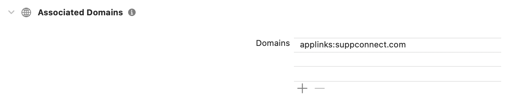
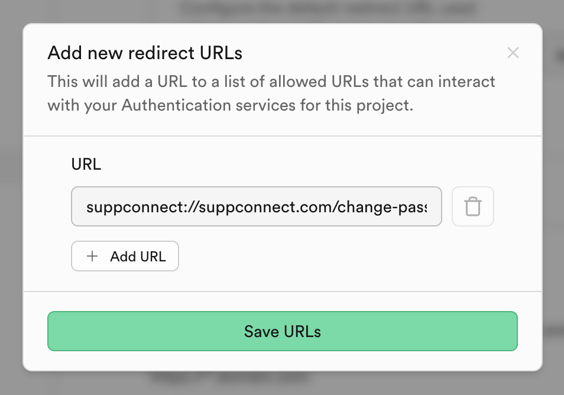

To get started, choose a scheme and host name. You will use these to create the redirect URL for your app:

```
[YOUR_SCHEME]://[YOUR_HOSTNAME]
```

In this example, my redirect URL will be `suppconnect://suppconnect.com`. Next, we will update our Android and iOS code bases so they can handle links that use this scheme and host name.

## Setup Android

Add the following intent filter inside the `activity` tag in your `AndroidManifest.xml` file:

```xml
<intent-filter android:autoVerify="true">
    <action android:name="android.intent.action.VIEW" />
    <category android:name="android.intent.category.DEFAULT" />
    <category android:name="android.intent.category.BROWSABLE" />

    <data android:scheme="suppconnect" />
    <data android:host="suppconnect.com" />
</intent-filter>
```


## Setup iOS

Add just the scheme to your `info.plist` file. You may already have the `CFBundleURLSchemes` key (ex. for Google sign in) so if that's the case, just add a new line to the array:

```xml
<key>CFBundleURLTypes</key>
<array>
	<dict>
		<key>CFBundleTypeRole</key>
		<string>Editor</string>
		<key>CFBundleURLSchemes</key>
		<array>
			<string>suppconnect</string>
		</array>
	</dict>
	<dict />
</array>
```

In Xcode, select the Runner Target -> Signing & Capabilities and then add the "Associated Domains" capability. Then, add a domain that uses the following format:

```
applinks:[YOUR_SCHEME]
```

For example:
```
applinks:suppconnect
```



## [Setup Supabase](https://supabase.com/docs/guides/auth/native-mobile-deep-linking?queryGroups=platform&platform=flutter#setting-up-deep-linking)

On the Authentication tab, select the "URL Configuration" option.

In the "Redirect URLs" section, add the custom domain from above:



In the case of a redirect URL for resetting a password, it will look like this:

```
suppconnect://suppconnect.com/change-password
```

## Send the Reset Password Email

In your app, trigger the reset password flow using the Supabase SDK. Set the `redirectTo` path to the custom domain from above:

```dart
await supabase.auth.resetPasswordForEmail(
    email,
    redirectTo: 'suppconnect://suppconnect.com/change-password',
);
```

## Listen for AuthChangeEvent.passwordRecovery

Your Flutter app should listen for auth state changes and redirect to 

```dart
supabase.auth.onAuthStateChange.listen((data) {
  final AuthChangeEvent event = data.event;
  final Session? session = data.session;
  debugPrint('Auth state changed: $event, session: $session');
  switch (event) {
    case AuthChangeEvent.signedIn:
      break;
    case AuthChangeEvent.signedOut:
      break;
    case AuthChangeEvent.passwordRecovery:
      router.push(ChangePasswordRoute());
    default:
      break;
  }
});
```

## Change the Password

On the change password page, the user will be authenticated. Here, you can ask them for a new password and update it like this:

```dart
final response = await supabase.auth.updateUser(
        UserAttributes(password: password),
);
```

## Resources

- https://codewithandrea.com/articles/flutter-deep-links/
- https://supabase.com/docs/guides/auth/native-mobile-deep-linking?queryGroups=platform&platform=flutter

