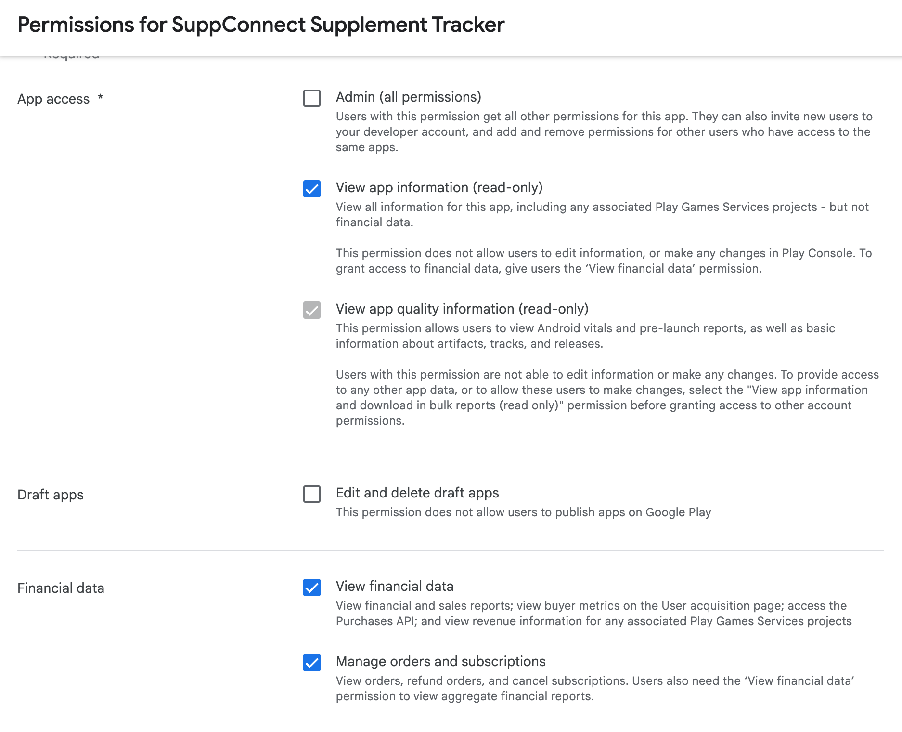
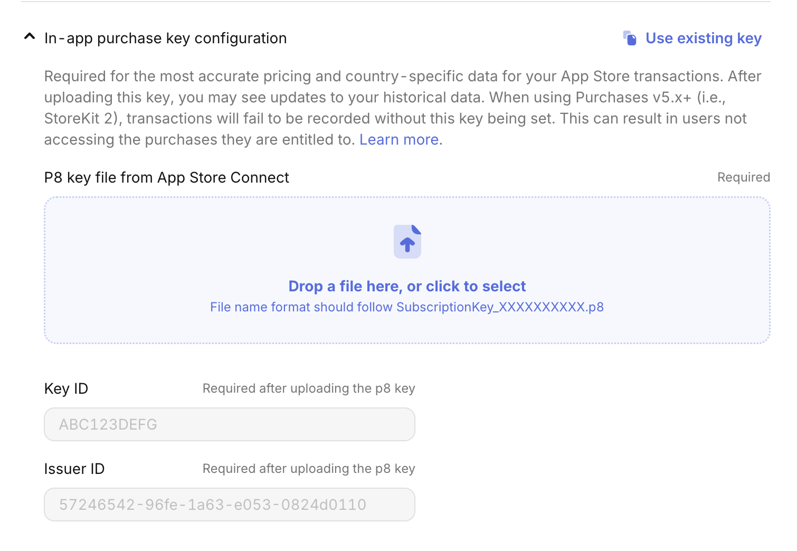

## Create a RevenueCat Project

## Google Play

### [Create Subscriptions](https://www.revenuecat.com/docs/getting-started/entitlements/android-products)

> You will need to upload an APK before you can add a subscription

In the Google Play Console, select your app.

1. Expand the "Monetize with Play" section
2. Select "Products"
3. Select "Subscriptions"

### Enable APIs

[RevenueCat Guide](https://www.revenuecat.com/docs/service-credentials/creating-play-service-credentials#1-enable-the-google-developer-and-reporting-api)

In the Google Cloud Console, select your project from the dropdown. Enable both the [Google Play Android Developer](https://console.cloud.google.com/apis/library/androidpublisher.googleapis.com) and [Google Play Developer Reporting](https://console.cloud.google.com/apis/library/playdeveloperreporting.googleapis.com) APIs.

### Create a Service Account

Navigate to the [Service Accounts page](https://console.cloud.google.com/iam-admin/serviceaccounts) in Google Cloud. Select "Create Service Account".

1. Add a name
2. Add the *Pub/Sub Editor* and *Monitoring Viewer* roles
3. Press Done

On the Service accounts page, select the 3 dots next to the service account you just created and select "Manage Keys".

1. Select "Add key"
2. Select "Create new key"
3. Select "JSON"
4. Select "Create"

The key will be auto-downloaded.

Copy the Email of the new Service account.

### Invite the Service Account to Google Play

In the Google Play Console on the Users and Permissions tab, select "Invite User". Paste in the email from the previous step. Add the following permissions:

Select "Send Invite".

### Add the Service Account to RevenueCat

In the RevenueCat dashboard:
1. Select your app
2. Select "Apps & Providers"
3. Select your android app (or create one)
4. Add the Service Account JSON and wait ~24 hours

## Apple App Store

### [Create Subscriptions](https://www.revenuecat.com/docs/getting-started/entitlements/ios-products)

### [Create an In-App Purchase Key](https://www.revenuecat.com/docs/service-credentials/itunesconnect-app-specific-shared-secret/in-app-purchase-key-configuration)

### Add the In-App Purchase Key to RevenueCat

If you already have an iOS app that uses RevenueCat, you can reuse the In-app purchase key. Just select "Use existing key" and select the one for your existing app.

Save changes.

## [Create an Entitlement](https://www.revenuecat.com/docs/getting-started/entitlements#creating-an-entitlement)

In the RevenueCat dashboard, select your app:

1. Select the "Product Catalog" from the sidebar
2. Select the "Entitlements" tab
3. Click "New Entitlement"
4. Give the entitlement a name (ex. "premium") and a description (ex. "Access to premium features")

## Create an Offering

## Add Products