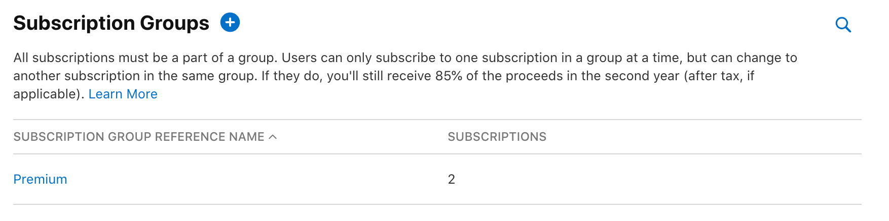
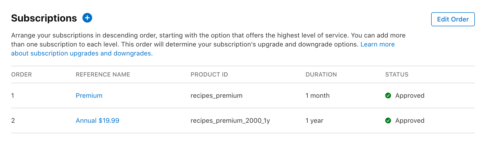
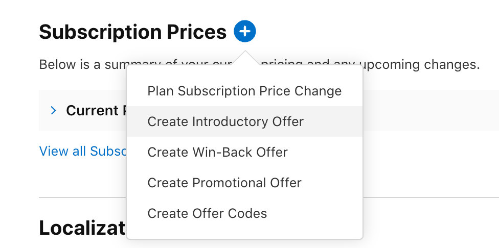
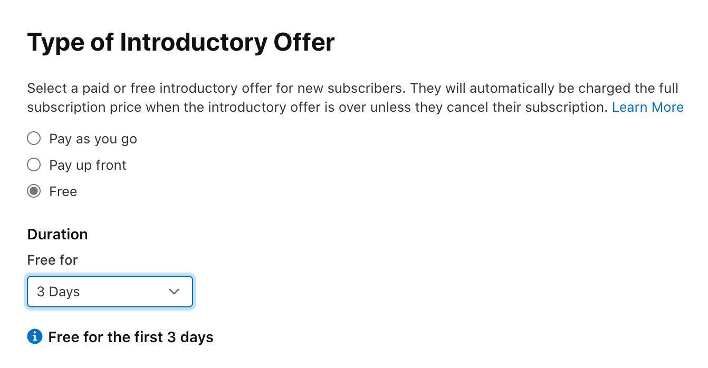

## Locate your subscription

1. In the App Store Connect console, select your app. 
2. Under the "Monetization" section, select the "Subscriptions" option. 
3. In the "Subscription Groups" section, select the subscription group to add the introductory offer to.

## Create the introductory offer
1. On the subscriptions page, select one of the subscriptions from the list.

2. Scroll down to "Subscription Prices" and press the blue plus button.
3. Select "Create Introductory Offer".

4. Select the regions where the offer should be available.
5. Select the start and end dates for the offer (select "No End Date" for the offer to always be active).
6. On the "Type of Introductory Offer" page, select "Free" and the duration of the free trial.

7. Confirm your choices.