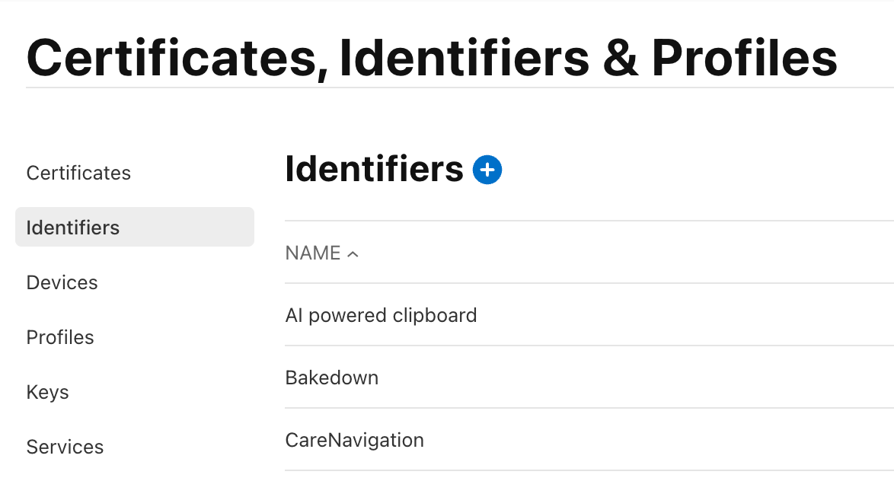
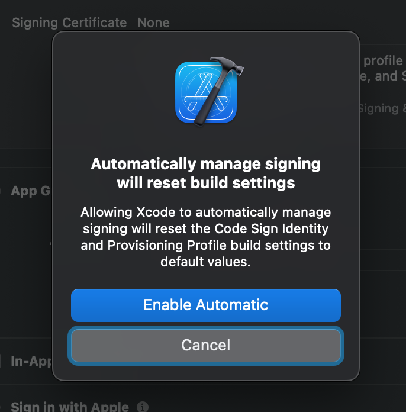
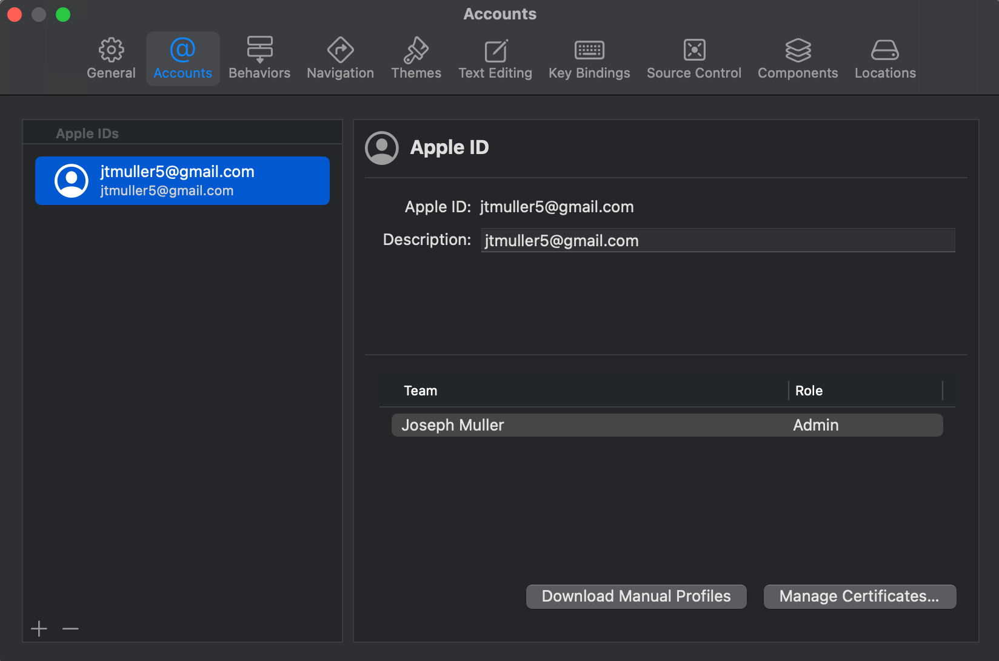
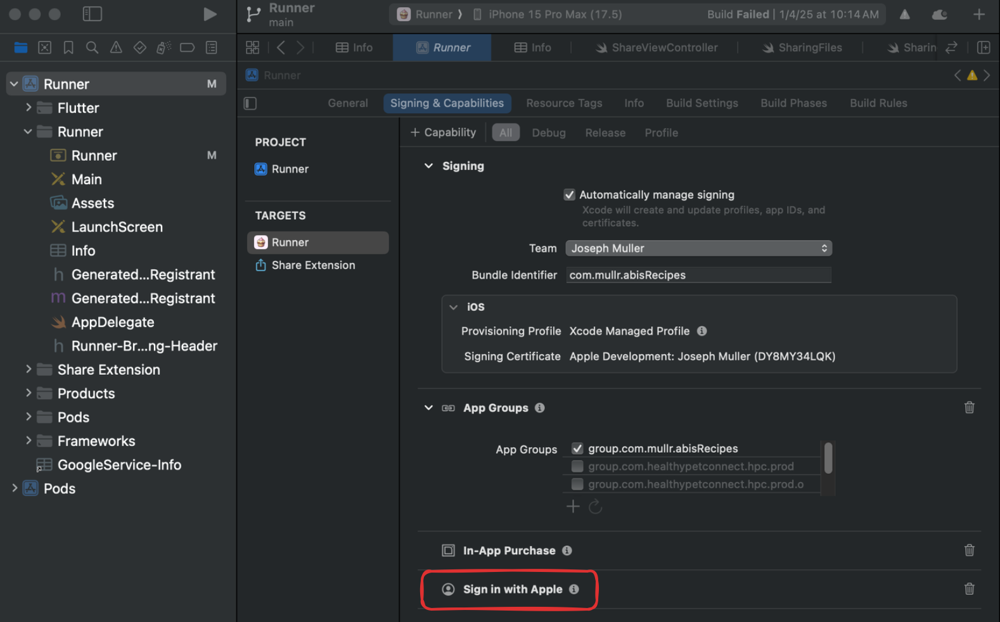
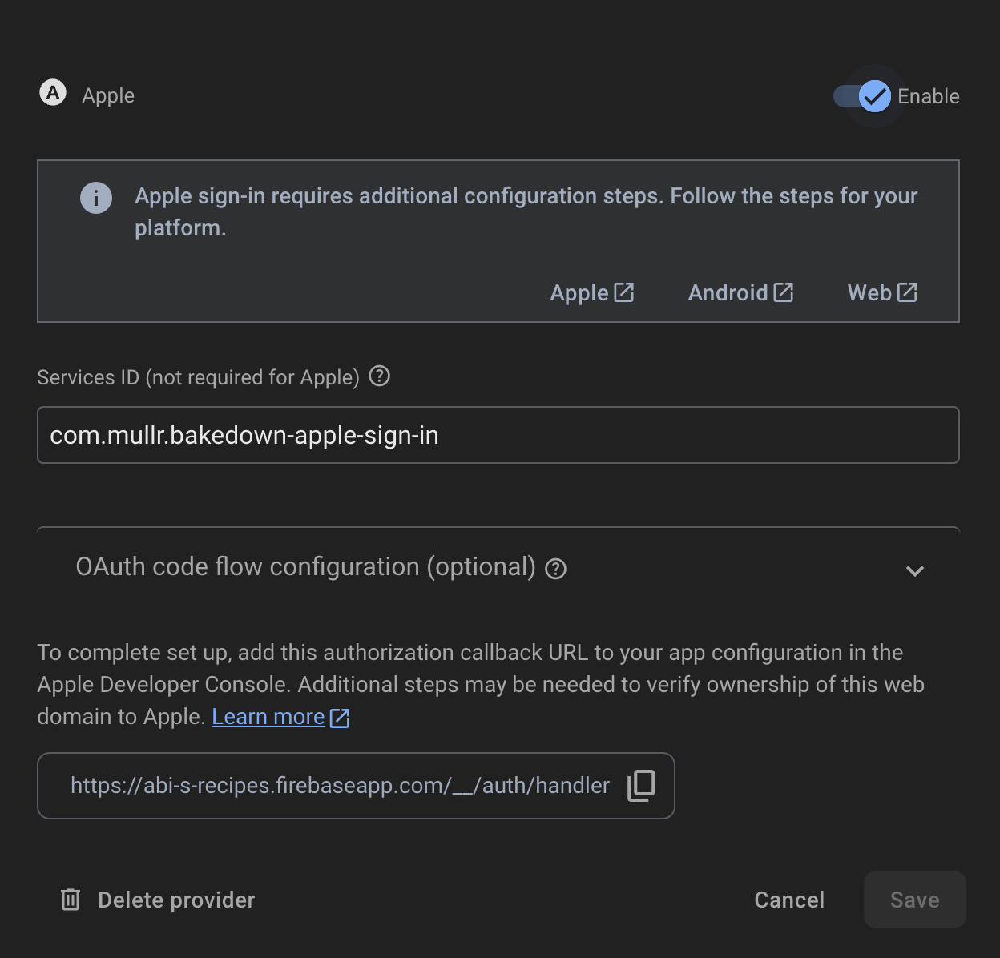
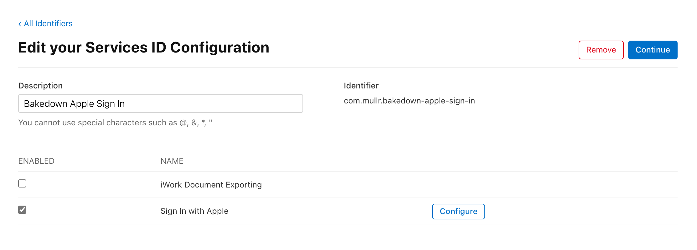
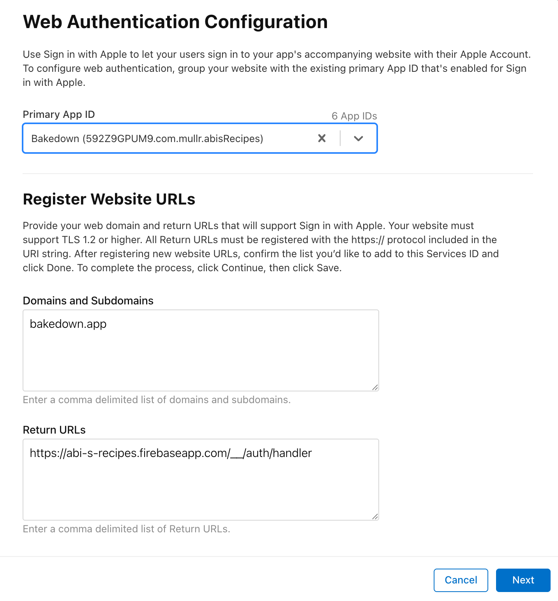
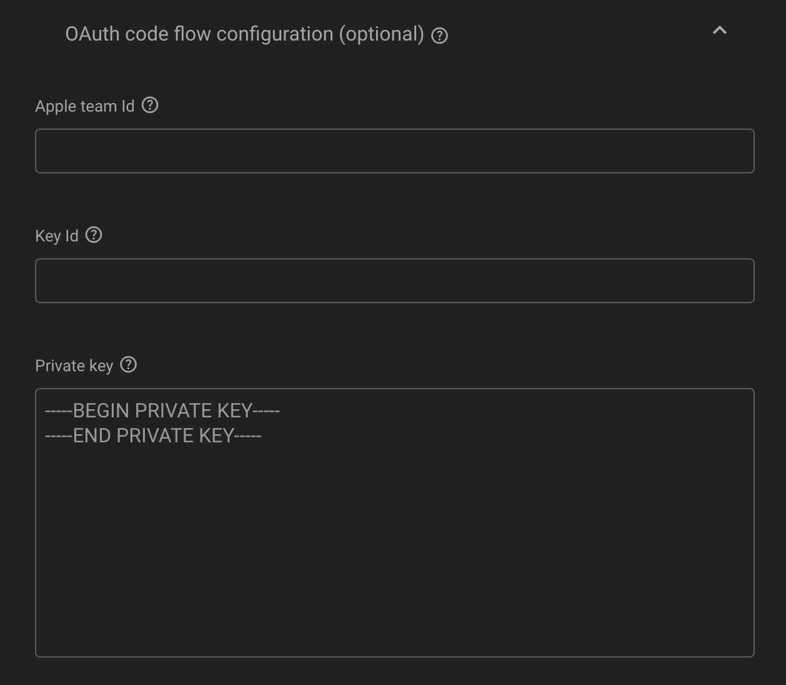

Adding Apple Sign In to a Flutter and Firebase app is a multi-step process documented across numerous websites. This guide aims to aggregate all of the relevant documentation into one place.

## Install the sign_in_with_apple plugin

Add the following line to your `pubspec.yaml` file to install the [sign_in_with_apple](https://pub.dev/packages/sign_in_with_apple) plugin:

```yaml
sign_in_with_apple: ^7.0.1
```

## Register an App ID

In the Apple Developer dashboard, navigate to the [Certificates, Identifiers & Profiles page](https://developer.apple.com/account/resources/identifiers/list/bundleId) and select the Identifiers tab. Select the blue plus button next to the "Identifiers" title:



Select "App IDs" and "App" from the following two screens. 

On the Register an App ID page, fill in the description (your app name) and Bundle ID (com.example.my-app). On the capabilities tab, scroll down and select "Sign In with Apple". Press the "Edit" button and save the default settings.

## Add the Sign In With Apple Capability

If you created a new app following the above instructions, the sign in with Apple capability should already be selected.

If you have an existing app, locate it in the [identifiers list](https://developer.apple.com/account/resources/identifiers/list) and select the Sign In With Apple capability from the capabilities tab.

After doing this, you will need to fetch the updated provisioning profiles in Xcode to use the new capabilities. The simplest way to do this is to toggle automatic signing on and off on the `Signing & Capabilities` tab:



You can also manually download your provisioning profile by navigating to `Settings` -> `Accounts` and clicking "Download Manual Profiles":



To verify the capability has been added to your app, navigate to `Runner` -> `Targets` -> `Your App` -> `Signing & Capabilities` and verify that the Sign in with Apple capability is in the list. If not, press the plus button and add it:



## Enable Apple Sign In in Firebase

In the Firebase console, open the `Authentication` tab and select `Sign-in method`. Select the "Apple" method, enable it, and then save. Copy the handler URL for the next step.



## Create a Service ID

> This is only required for Web and Android integrations

On the [Identifiers tab](https://developer.apple.com/account/resources/identifiers/list) in Certificates, Identifiers & Profiles, press the blue plus button to add a new Service ID. Select Service IDs from the options list.

Set a description and identifier. Jot down the identifier as you will need to add that to your Firebase config.

Description: Apple Sign In for Example app
Identifier: com.example.example-apple-sign-in

Register the Service ID.

On the next page, check the box next to "Sign in with Apple" and then click "Configure".



In the popup window:
1. Select your App ID as the Primary App ID
2. Add your website URL to the "Domains and Subdomains" section (omit "https://")
3. Add the firebase handler URL to the "Return URLs section"



## Create a Sign in with Apple Key

On the [keys tab](https://developer.apple.com/account/resources/authkeys/list) in Certificates, Identifiers & Profiles, press the blue plus button to create a new key. Ex. Example Sign in with Apple Key

Select the Sign in with Apple check box and press Configure.

From the dropdown, select your App ID.

Register the key and the download it. On the key details page, you will also find your "Key ID".

## Add Service ID to Firebase

Back in the Firebase Authentication tab, open the Apple Sign in method config and expand the OAuth code flow configuration section.



Add your service ID, team ID, key ID, and the private key you downloaded in the previous step. 

- You can find you team ID in your [Membership details](https://developer.apple.com/account#MembershipDetailsCard) section of your developer account.
- You can find the private key value by opening the `.p8` file downloaded in the Create a Sign in with Apple Key step. I usually just open it with VS Code.

## Resources

- [Authenticate Using Apple (Firebase)](https://firebase.google.com/docs/auth/ios/apple?authuser=0#enable-apple-as-a-sign-in-provider)
- [Flutter Apple Sign In](https://firebase.google.com/docs/auth/flutter/federated-auth?authuser=0#apple)
- [Request User Email from Apple](https://stackoverflow.com/questions/77149700/firebase-authentication-with-apple-does-not-provide-user-email)